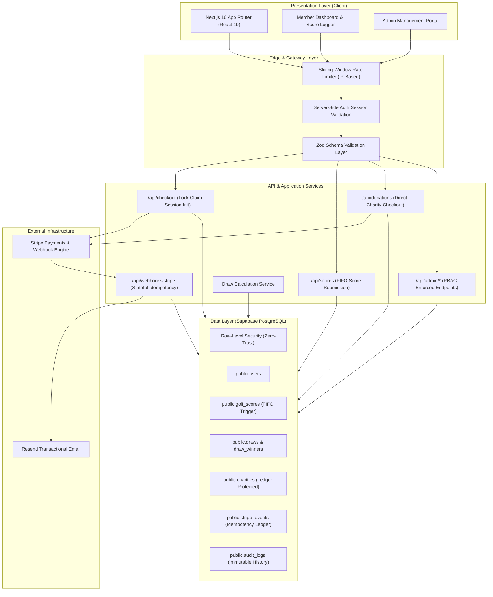
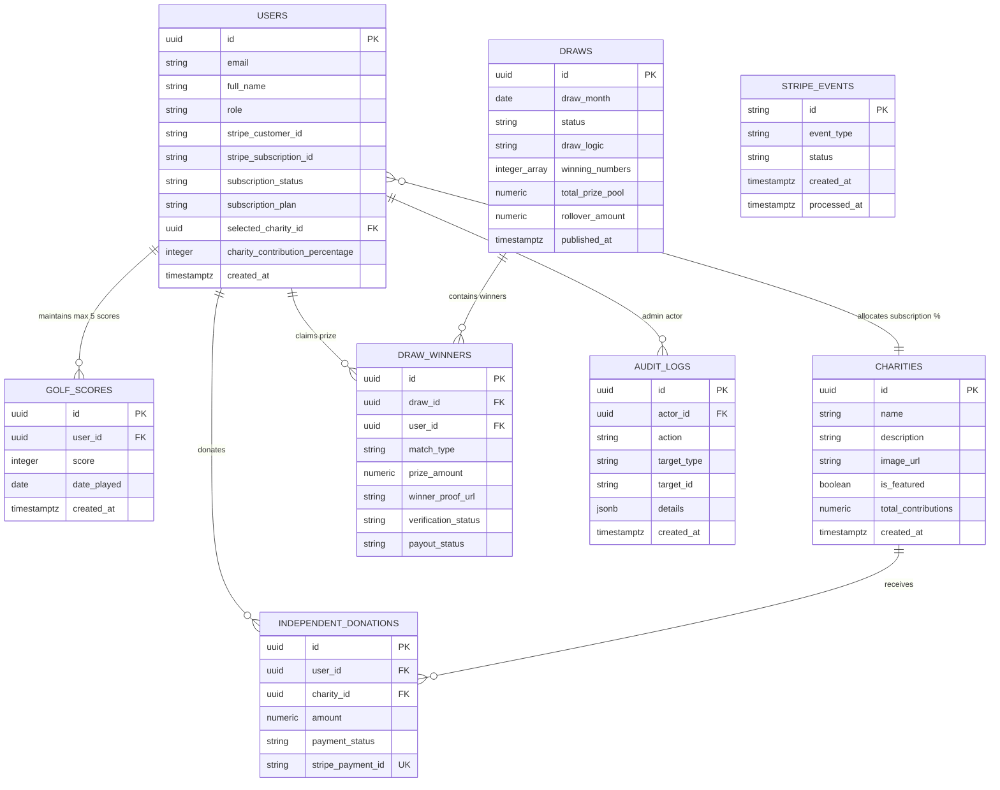

# GolfForGood

A full-stack SaaS platform connecting golf performance tracking with verified charitable giving and simulated monthly prize draws. Built with Next.js 16 (App Router), React 19, TypeScript, Supabase (PostgreSQL with Row-Level Security), and Stripe Billing.

[](https://nextjs.org/)
[](https://react.dev/)
[](https://www.typescriptlang.org/)
[](https://zod.dev/)
[](https://supabase.com/)
[](https://stripe.com/)
[](https://vitest.dev/)

---

## Executive Summary

GolfForGood enables golfers to log their authentic 18-hole Stableford rounds, automate charitable contributions through their membership dues, and participate in monthly skill-based prize draws.

The platform is designed with an emphasis on relational database integrity, idempotent financial transaction processing, rate limiting, and zero-trust security.

> **Project Scope**: The monthly prize draws and winner payouts operate as a simulated mathematical demonstration. This application is an educational and portfolio engineering project and is not an operational commercial gambling or lottery service.

---

## Real-World Operational Workflows

### 1. Subscription Onboarding & Charity Allocation
1. **Selection & Intent**: The user registers and selects either a Monthly (₹499/mo) or Yearly (₹4,999/yr) plan, along with their chosen partner charity and contribution percentage (10% to 50%).
2. **Checkout Session Creation**:
   - Client sends `POST /api/checkout` with `{ plan: "monthly" }`.
   - API verifies authentication session and applies sliding-window rate limit (5 req/min).
   - Database acquires a 5-minute row lock (`claim_checkout_lock`) on `public.users` to prevent duplicate concurrent checkouts.
   - API initializes a hosted Stripe Checkout session with customer email and metadata.
3. **Payment & Activation**:
   - User completes payment on Stripe.
   - Stripe dispatches `checkout.session.completed` to `/api/webhooks/stripe`.
   - Webhook checks signature, claims event in `public.stripe_events`, activates the user profile (`subscription_status = 'active'`), and records charity allocation preferences.
   - Resend sends a subscription confirmation email.

### 2. Golf Score Logging & 5-Round FIFO Pruning
1. **Submission**:
   - Golfer logs round at `/dashboard`: score (1–45 Stableford points) and date played.
   - Client sends `POST /api/scores` with `{ score: 38, date_played: "2026-08-20" }`.
2. **Validation & Rate Limiting**:
   - IP rate limiter allows up to 10 submissions per minute.
   - Zod schema validates Stableford score range and rejects future dates or dates older than 2 years.
3. **Database FIFO Pruning**:
   - The API invokes the PostgreSQL function `add_golf_score(p_user_id, p_score, p_date_played)`.
   - The procedure locks the user row (`PERFORM ... FOR UPDATE`), counts existing scores in `public.golf_scores`, deletes the oldest record if 5 scores already exist, and inserts the new score in a single atomic transaction.
4. **UI Update**:
   - The dashboard updates in real time, rendering the 5-round card and calculating the member's current scoring average.

### 3. Monthly Prize Draw Execution & Rollover
1. **Eligibility Filter**:
   - The draw engine queries all active subscribers who possess exactly 5 recorded golf scores.
2. **Draw Computation**:
   - Admin triggers draw simulation from `/admin/draws`.
   - System generates 5 unique winning numbers (1–45) using CSPRNG.
   - Each member's 5 scores are matched against the winning set:
     - 5 Matches: 40% of pool (Tier 1 Jackpot)
     - 4 Matches: 35% of pool (Tier 2)
     - 3 Matches: 25% of pool (Tier 3)
3. **Integer Arithmetic & Pool Conservation**:
   - All allocations are calculated in integer paise/cents.
   - If any tier has zero winners, its allocation and any division remainders automatically roll over into `rollover_amount` for next month's jackpot.
4. **Atomic Publication**:
   - Admin confirms publication via `POST /api/admin/draws` with `{ action: "publish" }`.
   - Stored procedure `publish_draw_atomic` executes status transition, bulk-inserts winners into `public.draw_winners`, updates pool totals, and logs an immutable entry to `public.audit_logs`.

### 4. Scorecard Verification & Payout Pipeline
1. **Winner Notification**:
   - Winners see a verification banner in `/dashboard/draws`.
2. **Proof Upload**:
   - Golfer enters the URL of their signed physical scorecard photo.
   - Client updates `public.draw_winners.winner_proof_url`. A database trigger blocks updates to any other column while status is `pending`.
3. **Administrative Review**:
   - Admin views the proof URL in `/admin/winners`.
   - Admin approves or rejects the submission via `PATCH /api/admin/winners`.
4. **Payout Integrity**:
   - Database `CHECK` constraint (`chk_draw_winners_payout_verified`) rejects any update setting `payout_status = 'paid'` unless `verification_status = 'approved'`.

### 5. Direct Charity Donation Flow
1. **Donation Checkout**:
   - Any visitor or member selects a partner cause at `/charities` and enters a custom amount.
   - Client calls `POST /api/donations` with `{ charityId: "...", amount: 500 }`.
   - A one-time Stripe Checkout session is created with charity metadata.
2. **Idempotent Ledger Update**:
   - On payment completion, webhook receives `checkout.session.completed` with `type = 'donation'`.
   - Webhook calls `record_completed_donation()`, which inserts the donation into `public.independent_donations` guarded by `UNIQUE(stripe_payment_id)` and atomically increments `charities.total_contributions`.

---

## Key Features

- **Subscription Billing**: Recurring monthly (₹499/mo) and annual (₹4,999/yr) Stripe integration.
- **Charity Allocation**: 10%–50% of dues routed to partner charities with tamper-proof ledgers.
- **5-Round FIFO Score Tracking**: Stableford score logging with database-enforced FIFO history.
- **Simulated Monthly Prize Draws**: Multi-tier matching (5, 4, 3 matches) with mathematically conserved rollovers.
- **Scorecard Verification**: Proof URL upload queue with strict database check constraints.
- **Security & Reliability**: Zod validation, sliding-window rate limiting, RLS tenant isolation, and idempotent webhook handlers.

---

## System Architecture



---

## Technical Design & Security Highlights

### 1. Idempotent Stripe Webhook Processing
To prevent duplicate processing from network retries, the webhook handler implements a stateful ledger backed by `public.stripe_events`:
- **Cryptographic Signature**: Validates incoming payloads against the endpoint signing secret.
- **State Machine**:
  - `completed`: Returns immediate HTTP 200 OK without re-executing logic.
  - `processing` (< 300s old): Identified as in-flight; returns HTTP 200 OK to prevent race conditions.
  - `fresh / failed`: Claims execution lock, runs transaction, and transitions status to `completed` upon success or `failed` upon error.

### 2. Row-Level Security & Atomic Database Procedures (Fail-Closed Architecture)
- **PostgreSQL Row-Level Security (RLS)**: Enforces zero-trust tenant isolation across all tables (`users`, `golf_scores`, `draw_entries`, `draw_winners`, `independent_donations`). Dashboard and user APIs operate purely under the authenticated user's session with zero `adminDb` fallback reads or writes.
- **Strict Fail-Closed Transactional Procedures (`SECURITY DEFINER`)**:
  - `add_golf_score`: Serializes score submission with row-level locking (`FOR UPDATE`), enforces the 5-score FIFO limit, and validates bounds in a single atomic transaction. Fails closed with zero non-transactional direct table fallback.
  - `claim_checkout_lock`: Applies a 5-minute concurrency lock to prevent duplicate concurrent checkout sessions. Fails closed if lock acquisition fails.
  - `publish_draw_atomic`: Executes draw status updates, bulk winner insertion, rollover calculations, and audit logging within an atomic transaction.
  - `record_completed_donation`: Enforces unique payment constraint idempotency and updates charity ledgers securely.
- **Zero Unsafe Fallback Guarantee**: Correctness and security guarantees originate from database transactions and triggers; failure of any atomic procedure immediately terminates the request rather than falling back to uncoordinated direct writes.

### 3. Application-Level Rate Limiting
A sliding-window rate limiter protects sensitive endpoints against abuse:
- `/api/scores`: 10 requests / 60 seconds
- `/api/checkout`: 5 requests / 60 seconds
- `/api/donations`: 5 requests / 60 seconds
- `/api/billing`: 5 requests / 60 seconds
- Returns standard RFC headers (`X-RateLimit-Limit`, `X-RateLimit-Remaining`, `X-RateLimit-Reset`, `Retry-After`).

### 4. Input Validation & Type Safety
All client inputs are strictly validated at runtime using Zod before reaching any business logic or database operations:
- Scores: Constrained to integers between 1 and 45 points, with historical date boundaries.
- Donations & Subscriptions: Validated against allowable plans, valid charity UUIDs, and positive integer amounts.
- Draw Actions: Enforces valid state transitions (`simulate`, `publish`, `lock`).

### 5. Floating-Point Protection
All financial calculations (payout allocations, donation splits, and rollover remainders) operate strictly on integer cents/paise subunits to eliminate IEEE 754 floating-point rounding errors.

---

## Repository Structure

```
Golf-Platform/
├── src/
│   ├── app/                      # Next.js 16 App Router pages & route handlers
│   │   ├── admin/                # Admin portal (charities, draws, winners, users)
│   │   ├── api/                  # Backend REST route handlers
│   │   │   ├── admin/            # Admin management APIs (charities, draws, winners)
│   │   │   ├── billing/          # Stripe Customer Portal session handler
│   │   │   ├── checkout/         # Stripe checkout session creation
│   │   │   ├── donations/        # Direct charity donation checkout handler
│   │   │   ├── scores/           # Golf score submission (FIFO enforced)
│   │   │   └── webhooks/stripe/  # Stateful idempotent webhook receiver
│   │   ├── charities/            # Public charity directory & donation flow
│   │   ├── dashboard/            # Golfer member portal & score logger
│   │   ├── draws/                # Public draw results & winner verification
│   │   └── layout.tsx            # Global layout with navigation & providers
│   ├── components/               # Reusable UI components & modals
│   ├── lib/                      # Business logic, utilities, and validation
│   │   ├── validations/          # Zod schemas & runtime type guards
│   │   ├── rate-limit.ts         # Sliding-window IP rate limiter
│   │   ├── supabase.ts           # Supabase client & server initialization
│   │   └── utils/                # Integer currency arithmetic & formatting
│   └── __tests__/                # Vitest test suites (102 passing tests)
├── supabase/
│   └── schema.sql                # Complete PostgreSQL schema, RLS, triggers & RPCs
└── public/                       # Static assets & icons
```

---

## Database Schema



---

## API Reference

| Endpoint | Method | Authentication | Rate Limit | Description |
| :--- | :--- | :--- | :--- | :--- |
| `/api/checkout` | `POST` | User Session | 5 / min | Initiates Stripe Checkout session for subscription (atomic lock) |
| `/api/billing` | `POST` | User Session | 5 / min | Creates Stripe Customer Portal session |
| `/api/donations` | `POST` | Public / User | 5 / min | Initiates direct donation checkout session |
| `/api/profile` | `GET`, `POST` | User Session | 15 / min | Reads profile and updates user settings under RLS boundaries |
| `/api/charity` | `POST` | User Session | 10 / min | Updates partner charity allocation preferences |
| `/api/auth/password` | `POST` | User Session | 5 / min | Cryptographically verifies current password & updates credentials |
| `/api/scores` | `GET` | User Session | Standard | Fetches member's 5-score history |
| `/api/scores` | `POST` | User Session | 10 / min | Submits a new Stableford score (FIFO enforced via atomic RPC) |
| `/api/webhooks/stripe` | `POST` | Stripe Signature | Webhook | Handles asynchronous Stripe event notifications with stateful claim |
| `/api/admin/charities` | `GET`, `POST`, `PATCH`, `DELETE` | Admin Role | Standard | CRUD operations on partner charities |
| `/api/admin/draws` | `GET`, `POST` | Admin Role | Standard | Simulates, publishes, or locks monthly draws |
| `/api/admin/winners` | `GET`, `PATCH` | Admin Role | Standard | Reviews scorecard proofs and updates payout status |
| `/api/admin/users` | `GET`, `PATCH` | Admin Role | Standard | Lists member profiles and manages roles/subscriptions |

---

## Automated Testing

The codebase includes an automated test suite executed with Vitest (102 tests):

| Test Suite | File | Tests | Focus Area |
| :--- | :--- | :--- | :--- |
| Security Regression | `src/__tests__/security-regression.test.ts` | 32 | RLS boundaries, RPC locks, fail-closed guards |
| Input Validation | `src/__tests__/validations.test.ts` | 24 | Zod schemas, boundary limits, sanitization |
| Authorization | `src/__tests__/auth-security.test.ts` | 13 | Role verification, privilege escalation checks |
| Draw Computation | `src/__tests__/draw.service.test.ts` | 12 | Prize pool splits, number generation, rollovers |
| Failure Recovery | `src/__tests__/failure-path-recovery.test.ts` | 8 | End-to-end critical failure path recoveries |
| Webhook Idempotency | `src/__tests__/webhook-idempotency.test.ts` | 8 | In-flight isolation, duplicate event prevention |
| Rate Limiting | `src/__tests__/rate-limit.test.ts` | 5 | Sliding-window eviction, header conformity |

```bash
npm test
```

---

## Getting Started

### Prerequisites
- Node.js 18+ or 20+
- npm 9+
- A Supabase account and project
- A Stripe account (Test Mode supported)

### Environment Configuration
Create a `.env.local` file in the project root:

```env
# Public Client Variables
NEXT_PUBLIC_SUPABASE_URL=https://your-project-ref.supabase.co
NEXT_PUBLIC_SUPABASE_ANON_KEY=your-supabase-anon-key
NEXT_PUBLIC_STRIPE_PUBLISHABLE_KEY=pk_test_...
NEXT_PUBLIC_APP_URL=http://localhost:3000

# Server-Only Variables
SUPABASE_SERVICE_ROLE_KEY=your-supabase-service-role-key
STRIPE_SECRET_KEY=sk_test_...
STRIPE_WEBHOOK_SECRET=whsec_...
STRIPE_MONTHLY_PRICE_ID=price_...
STRIPE_YEARLY_PRICE_ID=price_...
RESEND_API_KEY=re_...
EMAIL_FROM=Golf Platform <notifications@golfforgood.org>
```

| Variable | Scope | Description |
| :--- | :--- | :--- |
| `NEXT_PUBLIC_SUPABASE_URL` | Public | Supabase project API URL |
| `NEXT_PUBLIC_SUPABASE_ANON_KEY` | Public | Supabase anonymous API key for client queries |
| `NEXT_PUBLIC_STRIPE_PUBLISHABLE_KEY` | Public | Stripe publishable key for client elements |
| `NEXT_PUBLIC_APP_URL` | Public | Base application URL for Stripe redirect URLs |
| `SUPABASE_SERVICE_ROLE_KEY` | Server | Service role key for admin operations and webhook RPCs |
| `STRIPE_SECRET_KEY` | Server | Stripe API secret key for session creation and billing |
| `STRIPE_WEBHOOK_SECRET` | Server | Secret for cryptographic verification of webhook signatures |
| `STRIPE_MONTHLY_PRICE_ID` | Server | Stripe Price ID for ₹499/month recurring plan |
| `STRIPE_YEARLY_PRICE_ID` | Server | Stripe Price ID for ₹4,999/year recurring plan |
| `RESEND_API_KEY` | Server | Resend API key for transactional email delivery |
| `EMAIL_FROM` | Server | Sender email header for system notifications |

### Database Migration
Execute the SQL migration file in your Supabase SQL Editor:
- File: [`supabase/schema.sql`](file:///supabase/schema.sql)

This provisions all required tables, triggers, indexes, and Row-Level Security policies.

### Local Development
```bash
# Install dependencies
npm install

# Start development server
npm run dev
```

Visit [http://localhost:3000](http://localhost:3000) in your browser.

### Local Stripe Webhook Forwarding
To test Stripe checkout and recurring subscription webhooks locally:
```bash
# Forward incoming webhooks to your local server
stripe listen --forward-to localhost:3000/api/webhooks/stripe
```
Copy the webhook signing secret output by the CLI and assign it to `STRIPE_WEBHOOK_SECRET` in `.env.local`.

---

## Tech Stack Summary

- **Frontend**: Next.js 16.2 (App Router, Server & Client Components), React 19, Vanilla CSS Design System
- **Backend & APIs**: Next.js Route Handlers, Zod Runtime Validation
- **Database & Auth**: Supabase PostgreSQL, Row-Level Security, Database Functions (`SECURITY DEFINER`), Database Triggers
- **Payments & Invoicing**: Stripe Subscriptions, Checkout Sessions, Customer Billing Portal, Webhook Handlers
- **Testing**: Vitest
- **Communications**: Resend API

---

## License & Disclaimer

This project is open-source and built for educational and portfolio demonstration purposes. The monthly prize draws and prize calculations are simulated mechanisms designed to showcase full-stack software architecture and financial integrity patterns.
