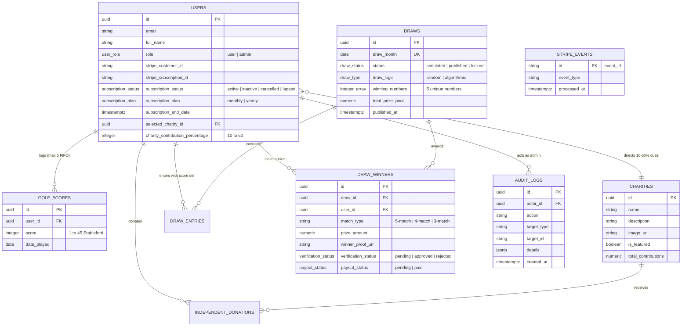

# ⛳ GolfForGood — Golf Charity Subscription & Prize Platform

> **A modern, full-stack platform uniting golf score tracking, verified charitable giving, and skill-based monthly prize draws.** Built with Next.js 16 (App Router), React 19, TypeScript, Supabase (PostgreSQL with RLS & DB Triggers), and Stripe Billing.

---

## 📌 Executive Summary

**GolfForGood** (simulated charity & prize draw platform) connects golfers' athletic performance with real-world philanthropic impact. Members maintain an active monthly or annual subscription, log their 18-hole Stableford golf scores (1–45 points), direct a percentage of their membership dues (10%–50%) to verified partner charities, and enter monthly skill-based prize draws.

---

## 🏗️ System Architecture

```
                                 ┌───────────────────────────────┐
                                 │     Next.js 16 App Router     │
                                 │  (React 19 Server Components) │
                                 └──────────────┬────────────────┘
                                                │
                 ┌──────────────────────────────┼──────────────────────────────┐
                 ▼                              ▼                              ▼
      ┌────────────────────┐         ┌────────────────────┐         ┌────────────────────┐
      │  Public Marketing  │         │  Member Dashboard  │         │    Admin Panel     │
      │  & Partner Causes  │         │ (Scores / Charity) │         │ (requireAdmin / DB)│
      └────────────────────┘         └──────────┬─────────┘         └──────────┬─────────┘
                                                │                              │
                                     ┌──────────▼──────────────────────────────▼──────────┐
                                     │        Next.js Route Handlers (API Layer)          │
                                     │   (Zod Validation, Session Auth & Error Guards)    │
                                     └──────────┬──────────────────────────────┬──────────┘
                                                │                              │
                        ┌───────────────────────▼──────┐            ┌──────────▼───────────────┐
                        │     Supabase / PostgreSQL    │            │      Stripe Platform     │
                        │  - Zero-Trust RLS Policies   │            │  - Checkout Subscriptions│
                        │  - Column Protection Triggers│            │  - Customer Portal       │
                        │  - Transactional FIFO Scores │            │  - Webhook Idempotency   │
                        │  - Audit Logs & Ledgers      │            └──────────┬───────────────┘
                        └──────────────────────────────┘                       │
                                        ▲                                      │
                                        └────────── Verified Webhook ──────────┘
```

### Mermaid Architecture Workflow


---

## 🗄️ Database Schema & Entity-Relationship (ER) Model



---

## 🛡️ Zero-Trust Security & Authorization Architecture

1. **Privilege Escalation Prevention (`protect_user_fields`)**:
   - PostgreSQL `BEFORE UPDATE` triggers prevent authenticated users from modifying sensitive columns (`role`, `subscription_status`, `subscription_plan`, `stripe_customer_id`, `stripe_subscription_id`, `subscription_end_date`).
   - Normal users may only modify non-sensitive profile fields (`full_name`, `selected_charity_id`, `charity_contribution_percentage`).
2. **Server-Side Administrative Verification (`requireAdmin`)**:
   - Server-side guard function queries the database to verify active session AND `users.role === 'admin'`.
   - Admin routes, server pages, and administrative APIs (`/api/admin/*`) reject unauthorized attempts with 401/403 or redirects.
3. **Winner Mutation Lockdown (`protect_draw_winner_fields`)**:
   - Non-admin users are strictly restricted to updating `winner_proof_url` and only while `verification_status = 'pending'`. Direct tampering with `prize_amount`, `match_type`, `verification_status`, or `payout_status` is blocked at the database trigger level.
4. **Stripe Webhook Idempotency (`stripe_events`)**:
   - Every incoming Stripe event is checked against the `stripe_events` table before processing, preventing duplicate execution and replay vulnerabilities.
5. **Transactional 5-Score FIFO Limit (`add_golf_score`)**:
   - Stableford score insertions are bounded by PostgreSQL logic ensuring that only the 5 most recent scores are active per user.
6. **Input Validation**:
   - All API endpoints validate payloads with strict schema validators (checking integers, ranges, future dates, UUIDs, and whitelisted enum plans).

---

## 🎰 Draw Engine & Prize Pool Mechanics

- **Winning Numbers Generation**: Generates 5 distinct random numbers between 1 and 45 (Stableford scale).
- **Match Tiers**:
  - **5-Number Match (Jackpot)**: Allocated **40%** of the prize pool (rolls over if 0 winners).
  - **4-Number Match**: Allocated **35%** of the prize pool (split equally among tier winners).
  - **3-Number Match**: Allocated **25%** of the prize pool (split equally among tier winners).
- **Lifecycle & Immutability**:
  $$\text{SIMULATED} \longrightarrow \text{PUBLISHED} \longrightarrow \text{LOCKED (Immutable)}$$
  Once locked, winning numbers, prize distributions, and winners cannot be modified by any user or administrator.

---

## 💻 Tech Stack

- **Framework**: Next.js 16.2.0 (App Router, Server Components, Route Handlers)
- **Language**: TypeScript 5
- **UI & Styling**: Vanilla CSS Design System with Curated Golf Palette (`#214E34` deep golf green, `#6B8E72` sage, `#D4A84F` gold, `#F7F8F5` background)
- **Database & Auth**: Supabase PostgreSQL, SSR Cookie Auth, Row Level Security (RLS)
- **Payments & Billing**: Stripe Checkout, Stripe Billing Portal, Webhook Handlers
- **Testing**: Vitest 3.0 (Unit, Validation, Security Barrier & Idempotency suites)
- **Transactional Email**: Resend API

---

## 🚀 Getting Started

### 1. Prerequisites
- Node.js 18.x or 20.x
- Supabase project credentials
- Stripe test account keys

### 2. Environment Configuration
Create `.env.local` in the root directory:

```env
# Supabase Configuration
NEXT_PUBLIC_SUPABASE_URL=https://your-project.supabase.co
NEXT_PUBLIC_SUPABASE_ANON_KEY=your-anon-key
SUPABASE_SERVICE_ROLE_KEY=your-service-role-key

# Stripe Configuration
STRIPE_SECRET_KEY=sk_test_...
STRIPE_WEBHOOK_SECRET=whsec_...
NEXT_PUBLIC_STRIPE_PUBLISHABLE_KEY=pk_test_...
STRIPE_MONTHLY_PRICE_ID=price_monthly_...
STRIPE_YEARLY_PRICE_ID=price_yearly_...

# Application URL
NEXT_PUBLIC_APP_URL=http://localhost:3000

# Email (Optional)
RESEND_API_KEY=re_...
```

### 3. Database Migration
Run the contents of [supabase/schema.sql](file:///supabase/schema.sql) in your Supabase SQL Editor to provision tables, triggers, indexes, and RLS policies.

### 4. Running the Development Server
```bash
npm install
npm run dev
```
Open [http://localhost:3000](http://localhost:3000) to view the application.

---

## 🧪 Automated Testing

Execute the Vitest automated test suite:

```bash
npm test
```

### Test Suites Included:
- **`src/__tests__/validations.test.ts`**: Score constraints (1–45), date formats, future date rejection, checkout plan whitelisting, donation UUID & bounds.
- **`src/__tests__/draw.service.test.ts`**: Winning number uniqueness, 5/4/3-match tier evaluation, mathematical prize pool split & rollover calculations.
- **`src/__tests__/auth-security.test.ts`**: Privilege escalation blocking, winner proof-only mutation enforcement, admin guard contracts.
- **`src/__tests__/webhook-idempotency.test.ts`**: Duplicate event suppression and single-flight processing.

---

## 📄 License & Disclaimer

This project is built for portfolio and educational purposes as a simulated golf charity subscription platform. It is not intended as a real-money lottery.
