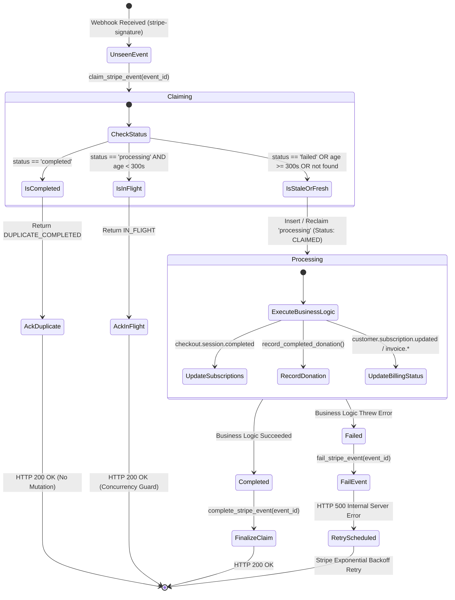
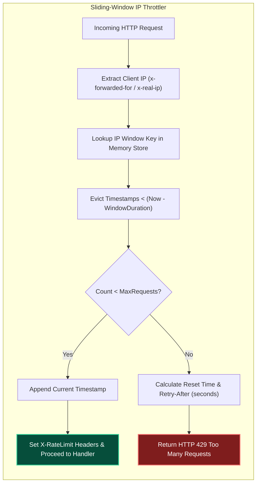
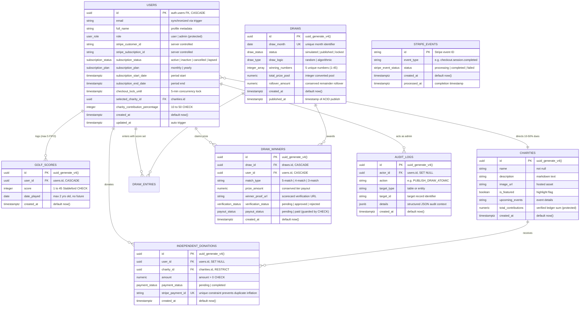

# ⛳ GolfForGood — Golf Charity Subscription & Prize Draw Platform

[](https://nextjs.org/)
[](https://react.dev/)
[](https://www.typescriptlang.org/)
[](https://zod.dev/)
[](https://supabase.com/)
[](https://stripe.com/)
[](https://vitest.dev/)

> **An enterprise-grade full-stack SaaS platform combining athletic golf score tracking, verified charitable contributions, and simulated skill-based monthly prize draws.** Built with Next.js 16 (App Router), React 19, TypeScript, Zod Schema Validation, Supabase (PostgreSQL with Row-Level Security, database triggers, and atomic `SECURITY DEFINER` stored procedures), and Stripe Billing.

---

## 📌 Project Scope & Educational Disclaimer

> [!NOTE]
> **Educational & Portfolio Demonstration**  
> **GolfForGood** is an educational software engineering project created to demonstrate full-stack architecture, relational database integrity, idempotent financial processing, application-level rate limiting, and stateful webhook synchronization.
> 
> The monthly prize draws and payout workflows are **simulated demonstrations** designed to showcase mathematical pool conservation, scorecard verification queues, and recoverable payout failure paths. This application is **not** an operational real-money gambling, lottery, or commercial wagering service.

---

## 📖 Overview & Core Mechanisms

**GolfForGood** connects golfers' athletic performance with verified philanthropic giving. Members maintain a recurring monthly (₹499/mo) or annual (₹4,999/yr) subscription, record their 18-hole Stableford golf scores (1–45 points), direct a customizable portion of their membership dues (10%–50%) to partner charities, and enter simulated monthly skill-based prize draws.

### Technical Pillars
- 🏆 **Athletic Score Tracking**: Members submit authentic golf rounds (1–45 Stableford points) with a strict 5-round FIFO history and proof scorecard uploads.
- 💚 **Philanthropic Allocation**: 10%–50% of membership dues and direct donations route to partner causes with real-time transparent ledgers.
- 🎰 **Simulated Prize Draws**: Monthly draws allocate 40% (Jackpot), 35%, and 25% across 5-match, 4-match, and 3-match score tiers, conserving all residual funds into rolling jackpots.
- 🛡️ **Technical Robustness**: Powered by Zod schema validation, sliding-window rate limiting, Supabase Row-Level Security (RLS), server-side role authorization, Stripe webhook signature verification, stateful idempotency with in-flight lock isolation, transactional PostgreSQL stored procedures (`SECURITY DEFINER`), and immutable administrative audit logs.

---

## 🏗️ System Architecture

### Multi-Tier Architecture Diagram

```mermaid
flowchart TD
    subgraph ClientTier["1. Presentation Tier (Client / Browser)"]
        UI["Next.js 16 App Router UI (React 19)"]
        Forms["Client Forms & Score Entry"]
        Portal["Member Dashboard & Stripe Portal Trigger"]
    end

    subgraph SecurityGateway["2. Edge & Security Gateway Tier"]
        RL["Sliding-Window IP Rate Limiter (src/lib/rate-limit.ts)"]
        CORS["Origin & Method Validation"]
        AuthGuard["Server-Side Auth Session Validation (auth.uid())"]
        ZodParser["Zod Schema Validation Layer (SafeParse + Type Guards)"]
    end

    subgraph AppLayer["3. Serverless API & Application Layer"]
        CheckoutAPI["/api/checkout (Lock Claim + Session Init)"]
        ScoreAPI["/api/scores (FIFO Score Submission)"]
        DonationAPI["/api/donations (Charity Direct Checkout)"]
        BillingAPI["/api/billing (Stripe Portal Session)"]
        AdminAPI["/api/admin/* (RBAC Enforced Admin Actions)"]
        WebhookAPI["/api/webhooks/stripe (Signature Verification)"]
        DrawEngine["Draw Computation Service (CSPRNG / Deterministic)"]
        EmailService["Transactional Email Service (Resend API)"]
    end

    subgraph StripeCloud["4. External Billing & Payment Infrastructure"]
        StripeCheckout["Stripe Checkout (Hosted Session)"]
        StripePortal["Stripe Customer Billing Portal"]
        StripeWebhooks["Stripe Webhook Delivery Engine"]
    end

    subgraph DataLayer["5. Supabase PostgreSQL Relational Data Layer"]
        RLS["PostgreSQL Engine (Row-Level Security Policies)"]
        UsersTab[("public.users (Profiles + Subscription State)")]
        ScoresTab[("public.golf_scores (Strict 5-Score FIFO)")]
        DrawsTab[("public.draws & public.draw_winners")]
        CharitiesTab[("public.charities (Ledger Protected)")]
        DonationsTab[("public.independent_donations (Unique Stripe ID)")]
        EventsTab[("public.stripe_events (Stateful Idempotency Ledger)")]
        AuditTab[("public.audit_logs (Immutable Admin History)")]
    end

    %% Client Interactions
    UI -->|"HTTP Requests"| RL
    Forms -->|"Score / Donation Data"| RL
    Portal -->|"Billing Portal Request"| RL

    %% Security Gateway Flow
    RL -->|"Within Limits (RFC Headers)"| CORS
    RL -.->|"Exceeded Limit"| R429["HTTP 429 Too Many Requests (Retry-After)"]
    CORS --> AuthGuard
    AuthGuard --> ZodParser

    %% Route Dispatching
    ZodParser -->|"Validated POST"| CheckoutAPI
    ZodParser -->|"Validated POST"| ScoreAPI
    ZodParser -->|"Validated POST"| DonationAPI
    ZodParser -->|"Validated POST"| BillingAPI
    ZodParser -->|"Admin Token + Role"| AdminAPI

    %% Application to Database RPCs
    CheckoutAPI -->|"RPC: claim_checkout_lock()"| UsersTab
    CheckoutAPI -->|"Init Subscription"| StripeCheckout
    ScoreAPI -->|"RPC: add_golf_score() [FOR UPDATE]"| ScoresTab
    DonationAPI -->|"Init Donation"| StripeCheckout
    BillingAPI -->|"Retrieve Customer ID"| UsersTab
    BillingAPI -->|"Create Portal Session"| StripePortal
    AdminAPI -->|"RPC: publish_draw_atomic()"| DrawsTab
    AdminAPI -->|"Log Audit Entry"| AuditTab

    %% Stripe Webhook Flow
    StripeWebhooks -->|"POST /api/webhooks/stripe (stripe-signature)"| WebhookAPI
    WebhookAPI -->|"RPC: claim_stripe_event()"| EventsTab
    WebhookAPI -->|"RPC: record_completed_donation()"| DonationsTab
    WebhookAPI -->|"Sync Subscription State"| UsersTab
    WebhookAPI -->|"RPC: complete_stripe_event()"| EventsTab
    WebhookAPI -->|"Trigger Notifications"| EmailService

    %% Database Internal Links
    ScoresTab -.->|"Foreign Key Cascade"| UsersTab
    DrawsTab -.->|"Foreign Key"| UsersTab
    DonationsTab -.->|"Foreign Key + Unique ID"| CharitiesTab
    UsersTab -.->|"Protected by"| RLS
    ScoresTab -.->|"Protected by"| RLS
    DrawsTab -.->|"Protected by"| RLS

    %% Styling
    classDef client fill:#0f172a,stroke:#38bdf8,stroke-width:2px,color:#ffffff;
    classDef gateway fill:#1e1b4b,stroke:#818cf8,stroke-width:2px,color:#ffffff;
    classDef app fill:#064e3b,stroke:#34d399,stroke-width:2px,color:#ffffff;
    classDef stripe fill:#312e81,stroke:#a78bfa,stroke-width:2px,color:#ffffff;
    classDef db fill:#14532d,stroke:#4ade80,stroke-width:2px,color:#ffffff;

    class UI,Forms,Portal client;
    class RL,CORS,AuthGuard,ZodParser gateway;
    class CheckoutAPI,ScoreAPI,DonationAPI,BillingAPI,AdminAPI,WebhookAPI,DrawEngine,EmailService app;
    class StripeCheckout,StripePortal,StripeWebhooks stripe;
    class RLS,UsersTab,ScoresTab,DrawsTab,CharitiesTab,DonationsTab,EventsTab,AuditTab db;
```



---

### Architectural Sequence Flow

```mermaid
sequenceDiagram
    autonumber
    actor Member as Golfer / Member
    participant UI as Next.js 16 Frontend
    participant RL as Rate Limiter Layer
    participant API as Route Handlers (Zod + Auth)
    participant DB as Supabase PostgreSQL (RLS)
    participant Stripe as Stripe Platform
    participant Mailer as Resend Email Service

    %% 1. Subscription Checkout Flow
    rect rgb(15, 23, 42)
    Note over Member, Stripe: Step 1: Subscription Checkout & Concurrency Lock
    Member->>UI: Selects Plan & Signs Up
    UI->>RL: POST /api/checkout { plan: "yearly" }
    RL->>API: Rate limit check passes (5 req/min)
    API->>API: Zod schema safeParse(CheckoutSchema)
    API->>DB: RPC claim_checkout_lock(user_id) [Row Lock FOR UPDATE]
    DB-->>API: Lock acquired (5 min TTL)
    API->>Stripe: stripe.checkout.sessions.create()
    Stripe-->>API: Checkout Session URL
    API-->>UI: Redirect { url: session.url }
    Member->>Stripe: Completes Payment on Stripe Hosted Checkout
    end

    %% 2. Stateful Webhook Execution
    rect rgb(6, 78, 59)
    Note over Stripe, Mailer: Step 2: Webhook Delivery & Stateful Idempotency
    Stripe->>API: Webhook (checkout.session.completed) [stripe-signature]
    API->>API: stripe.webhooks.constructEvent(body, sig, secret)
    API->>DB: RPC claim_stripe_event(event_id, event_type)
    alt Fresh Event (First Delivery)
        DB-->>API: Status: 'CLAIMED'
        API->>DB: Fetch user profile & cross-check stripe_customer_id
        API->>DB: UPDATE public.users (status='active', plan='yearly', dates)
        API->>DB: RPC complete_stripe_event(event_id)
        API->>Mailer: sendEmail() [Subscription Confirmation]
        API-->>Stripe: HTTP 200 OK { received: true }
    else Retried Duplicate (Already Completed)
        DB-->>API: Status: 'DUPLICATE_COMPLETED'
        API-->>Stripe: HTTP 200 OK { received: true, duplicate: true }
    else In-Flight Duplicate (< 300s window)
        DB-->>API: Status: 'IN_FLIGHT'
        API-->>Stripe: HTTP 200 OK { received: true, in_flight: true }
    end
    end

    %% 3. Score Entry Flow
    rect rgb(30, 27, 75)
    Note over Member, DB: Step 3: Athletic Score Submission (5-Score FIFO)
    Member->>UI: Submits Stableford Score (e.g., 38 pts)
    UI->>RL: POST /api/scores { score: 38, date_played: "2026-08-17" }
    RL->>API: Rate limit check passes (10 req/min)
    API->>API: Zod schema safeParse(ScoreSchema) [1-45 pts, valid date]
    API->>DB: RPC add_golf_score(user_id, score, date) [FOR UPDATE]
    Note over DB: Serializes user row, counts scores, purges oldest if count >= 5
    DB-->>API: Returns new score UUID
    API-->>UI: HTTP 201 Created
    end

    %% 4. Monthly Draw & Publication
    rect rgb(20, 83, 45)
    Note over API, DB: Step 4: Draw Calculation & Atomic Publication
    API->>DB: Admin triggers Draw Engine (CSPRNG or SHA-256)
    DB->>API: Fetches active members with exactly 5 scores
    API->>API: Matches score sets, calculates prize splits (40%/35%/25%)
    API->>DB: RPC publish_draw_atomic(draw_id, winners_json, rollover)
    Note over DB: Single ACID transaction updates status, bulk inserts winners, writes audit log
    DB-->>API: Publication Confirmed
    DB-->>UI: Member views verified prize results & submits scorecard proof URL
    end
```



---

### Stateful Webhook Idempotency State Machine



---

### Rate Limiter Sliding-Window Flow



---

## 🗄️ Database Schema & Entity-Relationship (ER) Model



---

## ⚙️ Core Technical Mechanisms & Deep Dives

### 1. Zod Schema Validation & Inferred Type Safety
Every public and authenticated API endpoint executes schema validation before interacting with database RPCs or Stripe services.

- **`ScoreSchema`**: Enforces integer Stableford scores ($1 \le \text{score} \le 45$), ISO dates, maximum 2-year lookback, and rejects future dates.
- **`CheckoutSchema`**: Validates membership plans (`'monthly' | 'yearly'`) and success/cancel redirection URLs.
- **`DonationSchema`**: Requires valid UUID charity IDs and positive integer donation amounts.
- **`DrawActionSchema`**: Strictly validates administrator draw actions (`'simulate' | 'publish' | 'lock' | 'forceRegenerate'`) and optional CSPRNG seed tokens.
- **`ProofUrlSchema`**: Validates scorecard proof URLs against strict HTTPS regex patterns before permitting verification review.

```typescript
// Example: SafeParse pattern with RFC compliant 400 rejection
const parseResult = ScoreSchema.safeParse(await request.json());
if (!parseResult.success) {
  return NextResponse.json({
    error: 'Validation failed',
    issues: parseResult.error.flatten().fieldErrors
  }, { status: 400 });
}
const { score, date_played } = parseResult.data; // Fully typed ScoreInput
```

---

### 2. Application-Level Sliding-Window Rate Limiting
To defend against automated scraping, credential abuse, and concurrency spam, the platform implements an in-memory sliding-window rate limiter ([`src/lib/rate-limit.ts`](file:///src/lib/rate-limit.ts)).

- **Granular Endpoint Policies**:
  - `POST /api/scores`: Max 10 requests / 60 seconds
  - `POST /api/checkout`: Max 5 requests / 60 seconds
  - `POST /api/donations`: Max 5 requests / 60 seconds
  - `POST /api/billing`: Max 5 requests / 60 seconds
- **RFC-Compliant Response Headers**:
  - `X-RateLimit-Limit`: Maximum requests permitted within the window.
  - `X-RateLimit-Remaining`: Remaining request capacity.
  - `X-RateLimit-Reset`: Unix timestamp when the window resets.
  - `Retry-After`: Delta seconds to wait when HTTP 429 is returned.

---

### 3. Supabase Row-Level Security (RLS) & Stored Procedure Encapsulation
The PostgreSQL database runs in a zero-trust configuration with Row-Level Security enabled on all tables:

- **Score Isolation**: Standard users can only `SELECT` their own scores (`auth.uid() = user_id`). Direct client `INSERT` is disabled.
- **`SECURITY DEFINER` RPCs**: Modifications must invoke vetted stored procedures that validate caller identity inside the database transaction:
  - `add_golf_score(p_user_id, p_score, p_date_played)`: Acquires a row lock (`PERFORM ... FOR UPDATE`) on `public.users` to prevent concurrency races, validates Stableford bounds, counts existing records, and purges the oldest score if count $\ge 5$.
  - `claim_checkout_lock(p_user_id)`: Imposes a 5-minute atomic checkout lock to prevent duplicate concurrent Stripe checkout sessions.
  - `publish_draw_atomic(p_draw_id, p_winners, p_rollover, p_actor_id)`: Atomically transitions a draw to `published`, purges draft records, bulk inserts winners, sets rollovers, and logs administrative audit trails in a single ACID transaction.
  - `record_completed_donation(p_user_id, p_charity_id, p_amount, p_stripe_payment_id)`: Restricts execution to `service_role`, enforces `UNIQUE(stripe_payment_id)` idempotency, and updates charity contribution ledgers atomically.

---

### 4. Stateful Stripe Webhook Idempotency & 300s In-Flight Isolation
Stripe delivers webhooks via an "at-least-once" retry schedule. The webhook route handler ([`src/app/api/webhooks/stripe/route.ts`](file:///src/app/api/webhooks/stripe/route.ts)) implements a stateful idempotency ledger backed by `public.stripe_events`:

1. **Signature Verification**: Validates `stripe-signature` against `STRIPE_WEBHOOK_SECRET` using `stripe.webhooks.constructEvent()`.
2. **Stateful Event Claim (`claim_stripe_event`)**:
   - If event status is `completed`, returns `DUPLICATE_COMPLETED` $\to$ immediate HTTP 200 OK.
   - If event status is `processing` and age $< 300\text{s}$, returns `IN_FLIGHT` $\to$ immediate HTTP 200 OK to prevent concurrent duplicate execution.
   - If event is fresh, records status as `processing` and grants execution claim (`CLAIMED`).
   - If previous attempt failed or timed out ($> 300\text{s}$), re-claims event for safe retry.
3. **Fail-Closed Execution**: If any database mutation fails, the event is marked `failed` and returns HTTP 500, prompting Stripe to retry according to its backoff schedule.
4. **Finalization (`complete_stripe_event`)**: Once all business logic completes, status transitions to `completed`.

---

### 5. Conserved Float-Free Integer Currency Arithmetic
To eliminate JavaScript IEEE 754 floating-point drift (e.g. `0.1 + 0.2 = 0.30000000000000004`), all financial operations execute using integer subunits (paise / cents via `toCents` and `fromCents` in [`src/lib/utils/currency.ts`](file:///src/lib/utils/currency.ts)):

$$\text{Prize Pool} = \text{Base Pool} + \text{Rollover From Previous Month}$$

$$\text{Tier 1 (5-Match): } 40\% \quad | \quad \text{Tier 2 (4-Match): } 35\% \quad | \quad \text{Tier 3 (3-Match): } 25\%$$

$$\text{Total Distributed} + \text{Rollover}_{\text{next}} \equiv \text{Total Prize Pool}$$

Any unawarded tier allocations and integer division remainders roll over to the subsequent month's prize pool, guaranteeing complete mathematical pool conservation.

---

### 6. Scorecard Verification Pipeline & Defensive Trigger Rules
- **Winner Proof Update Guard**: A `BEFORE UPDATE` trigger on `public.draw_winners` restricts regular members to updating **only** `winner_proof_url` while `verification_status = 'pending'`.
- **Field Immobility**: All financial and status fields (`prize_amount`, `match_type`, `verification_status`, `payout_status`) are strictly protected against non-admin mutation.
- **Database CHECK Constraint**: `CONSTRAINT chk_draw_winners_payout_verified CHECK (payout_status != 'paid' OR verification_status = 'approved')` makes it physically impossible for PostgreSQL to store a `paid` winner without prior administrator verification approval.
- **Charity Ledger Trigger**: The `protect_charity_contributions` trigger prevents manual updates to `charities.total_contributions`, restricting ledger increments to verified `service_role` RPCs.

---

## 🔄 End-to-End Critical Path & Failure Recovery

| Lifecycle Stage | Expected Behavior | Defensive Implementation & Invariants |
| :--- | :--- | :--- |
| **1. Payment succeeds $\to$ Webhook received** | Subscription activated / donation logged. | Cryptographic signature validation, `claim_stripe_event()`, customer cross-check. |
| **2. Payment duplicated $\to$ No duplicate credit** | Member not double-charged; donation not duplicated. | `claim_checkout_lock()` blocks active members; `UNIQUE(stripe_payment_id)` prevents donation ledger inflation. |
| **3. Webhook retries $\to$ Idempotent** | Safe acknowledgment without re-running business logic. | `claim_stripe_event()` recognizes `completed` status and returns 200 OK without mutations. |
| **4. Draw succeeds $\to$ Prize accounting consistent** | Exact prize pool distribution without money loss. | Integer cents math; unawarded tier allocations and integer division remainders roll over to Month+1. |
| **5. Payout fails $\to$ State recoverable** | State is uncorrupted if a payout or network call fails. | Fail-closed error handling; `payout_status` remains `pending` and can be safely retried from the Admin Panel. |

---

## 💬 Architectural Q&A

### Q1: Why is the Stripe webhook idempotent?
> **Answer**: Stripe webhooks operate on an "at-least-once" delivery model. Network timeouts, slow database responses, or dropped connections can cause Stripe to retry delivering the exact same event multiple times. Without idempotency, a retried `checkout.session.completed` event could double-credit charity balances or create duplicate records. We enforce idempotency with a stateful `stripe_events` ledger and unique payment constraints so duplicate deliveries are recognized and safely acknowledged without re-executing business logic.

### Q2: Why is authorization enforced server-side?
> **Answer**: Client-side authorization checks (such as hiding UI buttons) can be trivially bypassed by inspecting JavaScript bundles or issuing direct HTTP requests. Enforcing authorization server-side in API route handlers (`assertAdminAPI()`) and inside the database layer (Supabase RLS and `SECURITY DEFINER` stored procedures) ensures that caller identity and permissions are authoritatively validated on every single mutation.

### Q3: How does Row-Level Security (RLS) protect tenant/user data?
> **Answer**: RLS operates at the PostgreSQL database engine level rather than relying on application code filters. When a query is executed, PostgreSQL evaluates the RLS policy against the authenticated caller's JWT (`auth.uid()`). This prevents horizontal privilege escalation (User A viewing or editing User B's scorecard) and vertical privilege escalation (a standard user updating their own role to admin or manually setting `payout_status = 'paid'`).

---

## 🔌 API Route Reference

| Endpoint | Method | Access Barrier | Rate Limit | Request Body / Query | Success Response | Status Codes |
| :--- | :--- | :--- | :--- | :--- | :--- | :--- |
| `/api/checkout` | `POST` | Authenticated | 5 / min | `{ plan: "monthly" \| "yearly" }` | `{ url: string }` | `200`, `400`, `401`, `409`, `429`, `500` |
| `/api/billing` | `POST` | Authenticated | 5 / min | None | `{ url: string }` | `200`, `400`, `401`, `429`, `500` |
| `/api/donations` | `POST` | Public / Auth | 5 / min | `{ charityId: UUID, amount: number }` | `{ url: string }` | `200`, `400`, `429`, `500` |
| `/api/scores` | `GET` | Authenticated | Standard | Query params | `{ scores: GolfScore[] }` | `200`, `401`, `500` |
| `/api/scores` | `POST` | Authenticated | 10 / min | `{ score: number, date_played: string }` | `{ score: GolfScore }` | `201`, `400`, `401`, `429`, `500` |
| `/api/webhooks/stripe` | `POST` | Stripe Signature | Webhook | Stripe Event Payload | `{ received: true }` | `200`, `400`, `500` |
| `/api/admin/charities` | `GET` | Admin Role | Standard | None | `{ charities: Charity[] }` | `200`, `401`, `403`, `500` |
| `/api/admin/charities` | `POST` | Admin Role | Standard | `{ name, description, is_featured, ... }` | `{ charity: Charity }` | `201`, `400`, `401`, `403`, `500` |
| `/api/admin/charities` | `PATCH` | Admin Role | Standard | `{ id, name, description, ... }` | `{ charity: Charity }` | `200`, `400`, `401`, `403`, `500` |
| `/api/admin/charities` | `DELETE`| Admin Role | Standard | `?id=UUID` | `{ success: true }` | `200`, `400`, `401`, `403`, `409`, `500` |
| `/api/admin/draws` | `GET` | Admin Role | Standard | None | `{ draws: Draw[] }` | `200`, `401`, `403`, `500` |
| `/api/admin/draws` | `POST` | Admin Role | Standard | `{ action: "simulate" \| "publish" \| "lock" }` | `{ draw: Draw, result: ... }` | `200`, `400`, `401`, `403`, `500` |
| `/api/admin/winners` | `GET` | Admin Role | Standard | `?draw_id=UUID` | `{ winners: WinnerDetail[] }` | `200`, `401`, `403`, `500` |
| `/api/admin/winners` | `PATCH` | Admin Role | Standard | `{ winner_id, verification_status, payout_status }` | `{ winner: Winner }` | `200`, `400`, `401`, `403`, `500` |
| `/api/admin/users` | `GET` | Admin Role | Standard | None | `{ users: UserProfile[] }` | `200`, `401`, `403`, `500` |

---

## 🧪 Automated Test Suites (97 Tests)

The repository features comprehensive unit, integration, and security regression test suites executed with **Vitest**:

```
 ✓ src/__tests__/security-regression.test.ts   (27 tests)
 ✓ src/__tests__/validations.test.ts           (24 tests)
 ✓ src/__tests__/auth-security.test.ts         (13 tests)
 ✓ src/__tests__/draw.service.test.ts          (12 tests)
 ✓ src/__tests__/failure-path-recovery.test.ts  (8 tests)
 ✓ src/__tests__/webhook-idempotency.test.ts    (8 tests)
 ✓ src/__tests__/rate-limit.test.ts             (5 tests)

 Test Files  7 passed (7)
      Tests  97 passed (97)
```

- [`src/__tests__/security-regression.test.ts`](file:///src/__tests__/security-regression.test.ts) (27 tests): Validates RLS boundaries, `SECURITY DEFINER` search path protections, 5-score FIFO pruning, direct mutation guards on `charities.total_contributions`, and checkout concurrency lock behavior.
- [`src/__tests__/validations.test.ts`](file:///src/__tests__/validations.test.ts) (24 tests): Tests Zod schema validation rules, boundary conditions, input sanitization, and helper type guards.
- [`src/__tests__/auth-security.test.ts`](file:///src/__tests__/auth-security.test.ts) (13 tests): Validates admin privilege checks (`assertAdminAPI`), session identity matching, and role tampering prevention.
- [`src/__tests__/draw.service.test.ts`](file:///src/__tests__/draw.service.test.ts) (12 tests): Validates CSPRNG / deterministic SHA-256 winning number generation, anti-inflation matching logic, and integer pool distribution.
- [`src/__tests__/failure-path-recovery.test.ts`](file:///src/__tests__/failure-path-recovery.test.ts) (8 tests): Validates the 5-stage critical path (payment $\to$ duplicate prevention $\to$ webhook idempotency $\to$ prize accounting $\to$ payout failure recovery).
- [`src/__tests__/webhook-idempotency.test.ts`](file:///src/__tests__/webhook-idempotency.test.ts) (8 tests): Validates stateful webhook claim transitions (`CLAIMED`, `IN_FLIGHT`, `DUPLICATE_COMPLETED`), 300s execution isolation, and retry safety.
- [`src/__tests__/rate-limit.test.ts`](file:///src/__tests__/rate-limit.test.ts) (5 tests): Tests sliding-window eviction, client IP separation, RFC header generation, and HTTP 429 throttling.

---

## 💻 Tech Stack

- **Framework**: Next.js 16.2.0 (App Router, Server Components, Route Handlers)
- **Runtime & Language**: Node.js 20.x, TypeScript 5
- **Schema Validation**: Zod 3.24.2
- **UI & Styling**: Vanilla CSS Design System with Curated Golf SaaS Palette
- **Database & Auth**: Supabase PostgreSQL (Row-Level Security, Database Triggers, `SECURITY DEFINER` RPCs)
- **Payments & Billing**: Stripe Subscriptions, Checkout Sessions, Customer Billing Portal, Webhook Handlers
- **Testing**: Vitest 3.0.7
- **Transactional Email**: Resend API

---

## 🚀 Getting Started

### 1. Prerequisites
- Node.js 18.x or 20.x
- npm 9+
- A Supabase Project ([supabase.com](https://supabase.com))
- A Stripe Account ([stripe.com](https://stripe.com))

### 2. Environment Configuration
Create a `.env.local` file in the root directory (see `.env.example`):

```env
# Public Variables (Browser Accessible)
NEXT_PUBLIC_SUPABASE_URL=https://your-project-ref.supabase.co
NEXT_PUBLIC_SUPABASE_ANON_KEY=eyJhbGciOi...
NEXT_PUBLIC_STRIPE_PUBLISHABLE_KEY=pk_test_51...
NEXT_PUBLIC_APP_URL=http://localhost:3000

# Private Variables (Server-Only)
SUPABASE_SERVICE_ROLE_KEY=eyJhbGciOi...
STRIPE_SECRET_KEY=sk_test_51...
STRIPE_WEBHOOK_SECRET=whsec_...
STRIPE_MONTHLY_PRICE_ID=price_1...
STRIPE_YEARLY_PRICE_ID=price_1...
RESEND_API_KEY=re_...
EMAIL_FROM=Golf Platform <notifications@golfforgood.org>
NODE_ENV=development
```

### 3. Database Setup
Copy the contents of [`supabase/schema.sql`](file:///supabase/schema.sql) and execute it in your **Supabase SQL Editor** to provision all tables, triggers, indexes, and RLS policies.

### 4. Running Locally
```bash
npm install
npm run dev
```
Open [http://localhost:3000](http://localhost:3000) in your browser.

### 5. Running the Test Suite
```bash
npm test
```

---

## 🛠️ Step-by-Step Git Commands (Clean Commit History)

### Commit 1: Zod Schema Integration
```bash
git add src/lib/validations/index.ts src/__tests__/validations.test.ts
git commit -m "feat(validations): wire Zod schemas with safeParse and inferred types"
```

### Commit 2: Sliding-Window Rate Limiter
```bash
git add src/lib/rate-limit.ts src/app/api/scores/route.ts src/app/api/checkout/route.ts src/app/api/donations/route.ts src/app/api/billing/route.ts src/__tests__/rate-limit.test.ts
git commit -m "feat(security): implement sliding-window rate limiting on mutation endpoints"
```

### Commit 3: Scaffolding Cleanup
```bash
git rm AGENTS.md
git commit -m "chore(cleanup): remove AGENTS.md scaffolding artifact"
```

### Commit 4: Architecture Diagrams & Enterprise Documentation
```bash
git add README.md
git commit -m "docs(architecture): upgrade system diagrams to multi-tier Mermaid and elevate README specifications"
```

---

## 📄 License & Disclaimer

This project is open source and built for educational and portfolio demonstration purposes as a simulated golf charity subscription platform. It is not intended for operational commercial gambling or real-money lottery operations.
