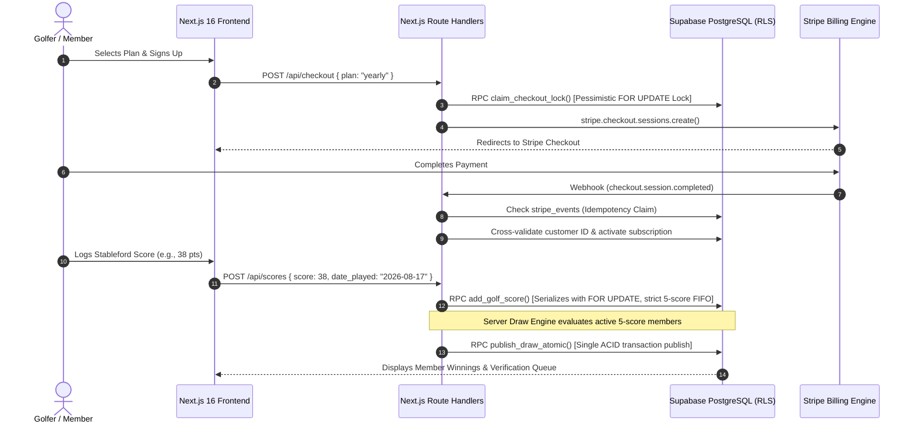
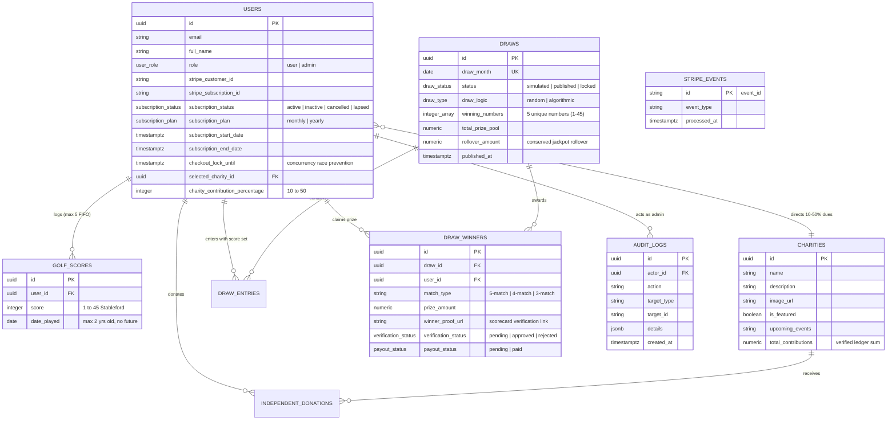

# ⛳ GolfForGood — Golf Charity Subscription & Prize Platform

[](https://nextjs.org/)
[](https://react.dev/)
[](https://www.typescriptlang.org/)
[](https://supabase.com/)
[](https://stripe.com/)
[](https://vitest.dev/)
[](https://github.com/Sekhar01807/Golf-Platform)

> **A full-stack SaaS platform uniting golf score tracking, verified charitable giving, and skill-based monthly prize draws.** Built with Next.js 16 (App Router), React 19, TypeScript, Supabase (PostgreSQL with RLS, DB triggers, and atomic RPCs), and Stripe Billing.

---

## 📌 Executive Summary

**GolfForGood** (simulated charity subscription and prize draw platform) connects golfers' athletic performance with verified philanthropic impact. Members maintain an active monthly (₹499/mo) or annual (₹4,999/yr) subscription, log their 18-hole Stableford golf scores (1–45 points), direct a percentage of their membership dues (10%–50%) to verified partner charities, and enter monthly skill-based prize draws.

### Core Value Pillars
- 🏆 **Athletic Gamification**: Members log authentic golf rounds (1–45 Stableford points) with strict 5-round FIFO history and proof scorecards.
- 💚 **Philanthropic Impact**: 10%–50% of membership dues and direct donations are routed to verified partner causes with real-time transparent ledgers.
- 🎰 **Skill-Based Prize Draws**: Monthly cryptographic prize draws allocate 40% (Jackpot), 35%, and 25% across 5-match, 4-match, and 3-match score tiers, conserving all residual funds into rolling jackpots.
- 🛡️ **Zero-Trust Security**: Hardened with pessimistic row locks, atomic single-transaction RPCs, caller-identity boundaries, database CHECK constraints, and fail-closed Stripe webhook idempotency.

---

## 🏗️ System Architecture

```
                                 ┌───────────────────────────────┐
                                 │     Next.js 16 App Router     │
                                 │  (React 19 Server Components) │
                                 └──────────────┬────────────────┘
                                                │
                 ┌──────────────────────────────┼──────────────────────────────┐
                 ▼                              ▼                              ▼
      ┌────────────────────┐         ┌────────────────────┐         ┌────────────────────┐
      │  Public Marketing  │         │  Member Dashboard  │         │    Admin Panel     │
      │  & Partner Causes  │         │ (Scores / Charity) │         │ (requireAdmin / DB)│
      └────────────────────┘         └──────────┬─────────┘         └──────────┬─────────┘
                                                │                              │
                                     ┌──────────▼──────────────────────────────▼──────────┐
                                     │        Next.js Route Handlers (API Layer)          │
                                     │   (Zod Validation, Session Auth & Error Guards)    │
                                     └──────────┬──────────────────────────────┬──────────┘
                                                │                              │
                        ┌───────────────────────▼──────┐            ┌──────────▼───────────────┐
                        │     Supabase / PostgreSQL    │            │      Stripe Platform     │
                        │  - Zero-Trust RLS Policies   │            │  - Checkout Subscriptions│
                        │  - Column Protection Triggers│            │  - Customer Portal       │
                        │  - Transactional FIFO Scores │            │  - Webhook Idempotency   │
                        │  - Pessimistic Row Locking   │            │  - User-Binding Checks   │
                        │  - Atomic Draw Publishing    │            └──────────┬───────────────┘
                        │  - Audit Logs & Ledgers      │                       │
                        └──────────────────────────────┘                       │
                                        ▲                                      │
                                        └────────── Verified Webhook ──────────┘
```

### End-to-End Workflow Diagram



---

## 🗄️ Database Schema & Entity-Relationship (ER) Model



---

## 🛡️ Zero-Trust Security & Authorization Architecture

### 1. Subscription Checkout Race Condition Mitigation (`claim_checkout_lock`)
- Prevents concurrent duplicate checkouts when a user spams the checkout button or opens parallel sessions.
- In `claim_checkout_lock(p_user_id)`, PostgreSQL executes `SELECT * FROM public.users WHERE id = p_user_id FOR UPDATE;`.
- Rejects requests if the user already has an active subscription or an active lock within the 5-minute window.

### 2. Concurrency-Safe 5-Score FIFO Boundary (`add_golf_score`)
- Serializes concurrent score submissions using `PERFORM id FROM public.users WHERE id = p_user_id FOR UPDATE;`.
- Validates score bounds (1–45), enforces non-future dates, restricts date horizon to $\le 2$ years, and discards oldest scores whenever counts exceed 5.
- Enforces a caller-identity boundary (`auth.uid() = p_user_id` or admin/service role).

### 3. Privilege Escalation Barrier (`protect_user_fields`)
- `BEFORE UPDATE` trigger on `public.users` blocks authenticated callers from mutating sensitive columns:
  - `role`, `subscription_status`, `subscription_plan`, `stripe_customer_id`, `stripe_subscription_id`, `subscription_start_date`, `subscription_end_date`.
- Non-admin users are strictly whitelisted to update `full_name`, `selected_charity_id`, and `charity_contribution_percentage` (10–50%).

### 4. Winner Proof Lockdown & Payout Invariants (`protect_draw_winner_fields`)
- Regular members can only upload `winner_proof_url` and only while `verification_status = 'pending'`.
- Attempts to alter `prize_amount`, `match_type`, `verification_status`, or `payout_status` are rejected.
- Direct database CHECK constraint (`chk_draw_winners_payout_verified`) ensures `payout_status = 'paid'` is impossible unless `verification_status = 'approved'`.

### 5. Atomic Single-Transaction Draw Publication (`publish_draw_atomic`)
- Prevents partial state mutations during draw publication.
- Locks the draw row (`FOR UPDATE`), verifies `status = 'simulated'`, writes winners, updates status to `'published'`, records `rollover_amount`, and logs the audit event inside a single ACID transaction.

### 6. Stateful Stripe Webhook Idempotency & Financial Retryability
- Webhook events operate on a stateful lifecycle: `processing` $\longrightarrow$ `completed` (or `failed`).
- An event is claimed in the `processing` state upon receipt via `claim_stripe_event` RPC.
- The event is **ONLY** marked `completed` after the financial/business database operations (user subscription activation, donation ledger increment, invoice status update) successfully commit.
- If a transient database or network error occurs during processing, the event is marked `failed` and the endpoint returns HTTP 500.
- When Stripe retries the event with exponential backoff, the idempotency engine allows the event to be re-claimed and re-executed, preventing any loss of subscription or donation state transitions.
- All webhook handler branches strictly check database mutation errors and fail closed.
- Webhook handlers cross-verify `customer.metadata.supabase_user_id` against database `users.id` and `users.stripe_customer_id`.

### 7. Explicit SQL Privilege Revocations & Role Grants
- Revoked all execution privileges from `PUBLIC`, `anon`, and `authenticated` on internal trigger functions (`handle_new_user`, `protect_user_fields`, `protect_draw_winner_fields`).
- Restricted administrative and financial RPCs (`publish_draw_atomic`, `record_completed_donation`, `claim_stripe_event`, `complete_stripe_event`, `fail_stripe_event`) strictly to `service_role`.
- Granted `claim_checkout_lock` and `add_golf_score` only to `authenticated` and `service_role`.

---

## 🎰 Draw Engine & Prize Pool Mechanics

```
   ┌───────────────────────────────────────────────────────────────┐
   │                   TOTAL MONTHLY PRIZE POOL                    │
   │      (₹200 / Active Subscriber + Conserved Rollover)          │
   └───────┬───────────────────────┬───────────────────────┬───────┘
           │                       │                       │
     40% Jackpot             35% Pool Share          25% Pool Share
           │                       │                       │
           ▼                       ▼                       ▼
   ┌───────────────┐       ┌───────────────┐       ┌───────────────┐
   │  5/5 Matches  │       │  4/5 Matches  │       │  3/5 Matches  │
   │ Equal Split / │       │  Equal Split  │       │  Equal Split  │
   │ Rollover (0W) │       │               │       │               │
   └───────┬───────┘       └───────┬───────┘       └───────┬───────┘
           │                       │                       │
           └───────────────────────┼───────────────────────┘
                                   │
                                   ▼
                   ┌───────────────────────────────┐
                   │   CONSERVED ROLLOVER POOL     │
                   │  - Unawarded tier allocations │
                   │  - Integer division remainders│
                   │  -> Carried forward to Month+1│
                   └───────────────────────────────┘
```

- **Authentic Eligibility**: Only active subscribers who have logged all 5 authentic rounds enter the draw.
- **Cryptographic Randomness**: Node.js `crypto.randomInt` (CSPRNG) for standard draws.
- **Deterministic Algorithmic Draws**: Seeded SHA-256 cryptographic digest derivation provides reproducible, verifiable winning numbers.
- **Anti-Inflation Score Matching**: Member scores are deduplicated prior to comparison (`[7, 7, 7, 7, 7]` matches winning 7 exactly once).
- **Conserved Residual Arithmetic**: All integer division remainders and unawarded tier pools are explicitly conserved into `rollover_amount` and carried forward into subsequent monthly draws.
- **Authoritative One-Way Lifecycle**:
  $$\text{SIMULATED} \longrightarrow \text{PUBLISHED} \longrightarrow \text{LOCKED (Immutable)}$$
  The simulated result is authoritative. Once published, numbers and winners cannot be re-rolled. Once locked, the draw is permanently frozen.

---

## 🔌 Complete API Route Reference

| Endpoint | Method | Access / Auth | Description | Status Codes |
| :--- | :--- | :--- | :--- | :--- |
| `/api/checkout` | `POST` | Authenticated | Claims concurrency lock & creates Stripe Subscription Checkout | `200`, `400`, `401`, `409`, `500` |
| `/api/billing` | `POST` | Authenticated | Creates Stripe Customer Billing Portal Session | `200`, `400`, `401`, `500` |
| `/api/donations` | `POST` | Public / Auth | Creates Stripe Checkout Session for verified charity donation | `200`, `400`, `500` |
| `/api/scores` | `GET` | Authenticated | Retrieves current authenticated member's 5 recent scores | `200`, `401`, `500` |
| `/api/scores` | `POST` | Authenticated | Submits score via transactional 5-score FIFO RPC | `200`, `400`, `401`, `500` |
| `/api/scores` | `DELETE` | Authenticated | Deletes a score owned by authenticated member | `200`, `400`, `401`, `500` |
| `/api/webhooks/stripe` | `POST` | Stripe Signature | Webhook handler with idempotency & customer binding verification | `200`, `400`, `500` |
| `/api/admin/charities` | `GET`, `POST`, `PUT`, `DELETE` | Admin Role | Charity CRUD with historical donation deletion protection | `200`, `400`, `401`, `403`, `409` |
| `/api/admin/draws` | `GET`, `POST` | Admin Role | Draw management: `simulate`, atomic `publish`, and `lock` | `200`, `400`, `401`, `403`, `500` |
| `/api/admin/winners` | `GET`, `PATCH` | Admin Role | Review scorecard proof URLs, approve/reject, authorize payout | `200`, `400`, `401`, `403`, `500` |
| `/api/admin/users` | `GET` | Admin Role | Lists member accounts, subscription states, and roles | `200`, `401`, `403`, `500` |

---

## 🎨 UI/UX Design System & Theme Specs

The interface features a **Clean Premium Golf + Philanthropy SaaS Aesthetic**:

```
 ┌────────────────────────────────────────────────────────────────────────┐
 │   Primary Deep Forest Green:  #214E34  (RGB: 33, 78, 52)               │
 │   Secondary Muted Sage:       #6B8E72  (RGB: 107, 142, 114)            │
 │   Accent Golf Gold:           #D4A84F  (RGB: 212, 168, 79)             │
 │   Crisp Linen Background:     #F7F8F5  (RGB: 247, 248, 245)            │
 │   Dark Charcoal Text:         #18231C  (RGB: 24, 35, 28)               │
 │   Subtle Border Tint:         #E3E8E3  (RGB: 227, 232, 227)            │
 └────────────────────────────────────────────────────────────────────────┘
```

- **Typography**: `Outfit` (600/700) for headers, `Inter` (400/500/600) for body and numbers.
- **Card Styling**: Pure white cards (`#FFFFFF`) with subtle borders (`1px solid #E3E8E3`) and micro-lift hover interactions.
- **Feedback & Notifications**: Centralized toast notification system ([`src/components/Toast/Toast.tsx`](file:///src/components/Toast/Toast.tsx)).

---

## 🧪 20-Point Security Regression Test Suite

All security guarantees and invariants are verified by the automated Vitest test suite in [`src/__tests__/security-regression.test.ts`](file:///src/__tests__/security-regression.test.ts):

| # | Regression Test Name | Covered Invariant |
| :---: | :--- | :--- |
| **1** | Self-Admin Escalation Guard | Blocks normal users from altering `role = 'admin'`. |
| **2** | Subscription Status Guard | Blocks normal users from self-activating `subscription_status = 'active'`. |
| **3** | Winner Payout Mutation Guard | Blocks winners from modifying `payout_status = 'paid'`. |
| **4** | Winner Prize Tampering Guard | Blocks winners from modifying their awarded `prize_amount`. |
| **5** | Admin API Authorization Barrier | Rejects unauthenticated (401) and non-admin (403) callers across admin endpoints. |
| **6** | Locked Draw Immutability | Enforces that locked draws can never be modified or re-rolled. |
| **7** | Future Score Date Rejection | Rejects score submissions with dates in the future. |
| **8** | Transactional 5-Score FIFO Limit | Discards oldest score when a 6th score is submitted, maintaining exactly 5. |
| **9** | Stateful Stripe Webhook Idempotency | Ensures events can be retried on business logic failure and only suppresses duplicates after completion. |
| **10** | Atomic Donation Ledger Update | Synchronously increments `charities.total_contributions` on completed donation. |
| **11** | Fail-Closed Webhook DB Error Guards | Returns HTTP 500 on database idempotency or update failure to trigger safe Stripe retries. |
| **12** | Duplicate Subscription Prevention | Blocks new checkout session initiation for members with active subscriptions. |
| **13** | Charity Deletion Cascade Guard | Returns HTTP 409 Conflict when attempting to delete a charity with donation records. |
| **14** | Draw Lifecycle State Machine | Enforces strict one-way transitions (`simulated` $\to$ `published` $\to$ `locked`). |
| **15** | Fail-Closed Audit Logging | Aborts critical operations if mandatory audit logging insertion encounters an error. |
| **16** | Score Age Horizon Constraints | Rejects scores older than 2 years or timestamped in the future. |
| **17** | Concurrent Checkout Lock Claim | Uses pessimistic row locks to prevent race conditions during checkout initiation. |
| **18** | Concurrency-Safe Serialized FIFO | Serializes simultaneous score additions with `FOR UPDATE` to guarantee $\le 5$ scores. |
| **19** | Atomic Draw Publication Rollback | Aborts the entire draw publication if any sub-step or winner insertion fails. |
| **20** | Webhook Customer-User Cross-Check | Cross-validates Stripe customer IDs against Supabase user records. |

### Complete Test Suites:
- `src/__tests__/security-regression.test.ts` (20 regression points)
- `src/__tests__/validations.test.ts` (Score, plan, donation, and admin input schemas)
- `src/__tests__/draw.service.test.ts` (CSPRNG, deterministic algorithmic draw, matching, rollover math)
- `src/__tests__/auth-security.test.ts` (Role escalation, proof-only mutations, RPC boundaries)
- `src/__tests__/webhook-idempotency.test.ts` (Event claim isolation and error handling)

---

## 💻 Tech Stack

- **Framework**: Next.js 16.2.0 (App Router, Server Components, Route Handlers)
- **Runtime & Language**: Node.js 20.x, TypeScript 5
- **UI & Styling**: Vanilla CSS Design System with Curated Golf SaaS Palette
- **Database & Auth**: Supabase PostgreSQL with RLS, Triggers, and Atomic Security Definer RPCs
- **Payments & Billing**: Stripe Subscriptions, Checkout, Billing Portal, Webhooks
- **Testing**: Vitest 3.0.7
- **Transactional Email**: Resend API

---

## 📁 Repository Structure

```
Golf-Platform/
├── src/
│   ├── app/
│   │   ├── admin/               # Server-guarded Admin Panel (draws, charities, winners, users)
│   │   ├── api/                 # Route Handlers (checkout, billing, donations, scores, webhooks, admin)
│   │   ├── auth/                # Login, Signup, Reset Password pages
│   │   ├── charities/           # Charity listing and direct donation flow
│   │   ├── dashboard/           # Member Dashboard (scores, charity selector, winnings)
│   │   ├── how-it-works/        # How it works & rules explainer
│   │   ├── globals.css          # Core Design System tokens & utility classes
│   │   ├── layout.tsx           # Root layout with Toast Provider and Navigation
│   │   └── page.tsx             # Landing page
│   ├── components/
│   │   ├── Admin/               # Admin Draw Manager, Charity Modal, Winner Table
│   │   ├── Footer/              # Global Footer
│   │   ├── Navbar/              # Global Navbar with auth state
│   │   ├── Toast/               # Global notification context & component
│   │   ├── BillingButton.tsx    # Stripe customer portal trigger
│   │   └── CheckoutButton.tsx   # Stripe checkout trigger
│   ├── lib/
│   │   ├── auth/                # Session and server-side admin role guards
│   │   ├── services/            # Draw simulation, publish, lock & audit logging services
│   │   ├── supabase/            # Client, Server, and Service-Role Supabase instances
│   │   ├── validations/         # Pure TypeScript & Zod validation schemas
│   │   ├── email.ts             # Resend transactional email helper
│   │   ├── env.ts               # Environment variable validation
│   │   └── stripe.ts            # Stripe SDK initialization
│   ├── types/
│   │   └── database.ts          # Database entity types and enums
│   └── __tests__/               # Vitest automated test suites
├── supabase/
│   └── schema.sql               # Production database schema, RLS, triggers & RPCs
├── .env.example                 # Classified environment configuration template
├── package.json                 # Dependencies and npm scripts
├── tsconfig.json                # TypeScript configuration
├── vitest.config.ts             # Vitest test runner configuration
└── README.md                    # System architecture & documentation
```

---

## 🚀 Getting Started

### 1. Prerequisites
- Node.js 18.x or 20.x
- npm 9+
- A Supabase Project ([supabase.com](https://supabase.com))
- A Stripe Developer Account ([stripe.com](https://stripe.com))

### 2. Environment Configuration
Create a `.env.local` file in the root directory and populate it with your credentials (see `.env.example`):

```env
# ── SECTION A: PUBLIC VARIABLES (Browser Accessible) ──
NEXT_PUBLIC_SUPABASE_URL=https://your-project-ref.supabase.co
NEXT_PUBLIC_SUPABASE_ANON_KEY=eyJhbGciOi...
NEXT_PUBLIC_STRIPE_PUBLISHABLE_KEY=pk_test_51...
NEXT_PUBLIC_APP_URL=http://localhost:3000

# ── SECTION B: PRIVATE / SECRET VARIABLES (Server-Only) ──
SUPABASE_SERVICE_ROLE_KEY=eyJhbGciOi...
STRIPE_SECRET_KEY=sk_test_51...
STRIPE_WEBHOOK_SECRET=whsec_...
STRIPE_MONTHLY_PRICE_ID=price_1...
STRIPE_YEARLY_PRICE_ID=price_1...
RESEND_API_KEY=re_...
EMAIL_FROM=Golf Platform <notifications@golfforgood.org>
NODE_ENV=development
```

### 3. Database Migration
Copy the contents of [`supabase/schema.sql`](file:///supabase/schema.sql) and execute it inside your **Supabase SQL Editor** to provision tables, triggers, indexes, and RLS policies.

### 4. Running the Development Server
```bash
npm install
npm run dev
```
Open [http://localhost:3000](http://localhost:3000) in your browser.

### 5. Running the Test Suite
```bash
# 1. Install project dependencies (including Vitest)
npm install

# 2. Run the automated Vitest test suite
npm test
```

> [!NOTE]
> All security models, schema constraints, RPC logic, and mathematical algorithms are covered by 5 Vitest suites across 20 regression specifications. Ensure dependencies are installed via `npm install` prior to running `npm test` so the Vitest binary is available in your local path.

---

## 📄 License & Disclaimer

This project is built for portfolio and educational purposes as a simulated golf charity subscription platform. It is not intended as a real-money lottery.
