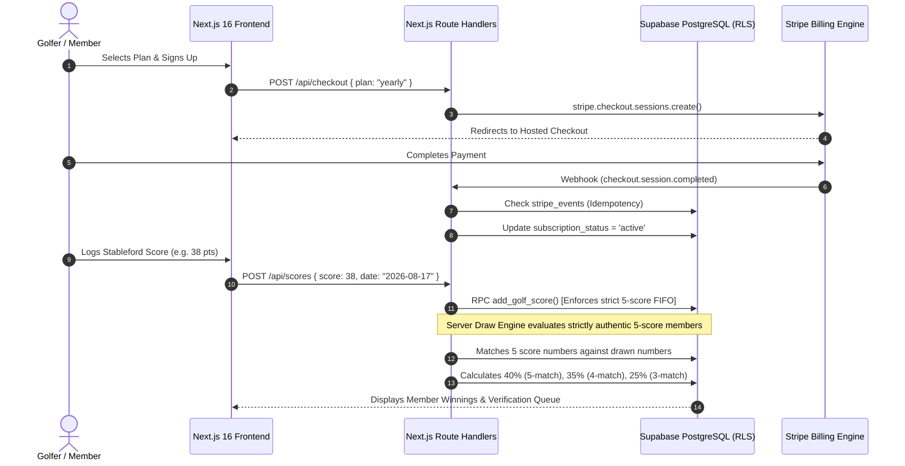
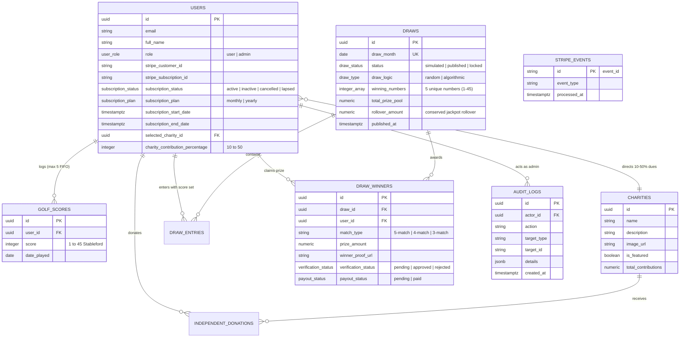

# ⛳ GolfForGood — Golf Charity Subscription & Prize Platform

[](https://nextjs.org/)
[](https://react.dev/)
[](https://www.typescriptlang.org/)
[](https://supabase.com/)
[](https://stripe.com/)
[](https://vitest.dev/)
[](https://github.com/Sekhar01807/Golf-Platform)

> **A modern, full-stack platform uniting golf score tracking, verified charitable giving, and skill-based monthly prize draws.** Built with Next.js 16 (App Router), React 19, TypeScript, Supabase (PostgreSQL with RLS & DB Triggers), and Stripe Billing.

---

## 📌 Executive Summary

**GolfForGood** (simulated charity & prize draw platform) connects golfers' athletic performance with real-world philanthropic impact. Members maintain an active monthly or annual subscription, log their 18-hole Stableford golf scores (1–45 points), direct a percentage of their membership dues (10%–50%) to verified partner charities, and enter monthly skill-based prize draws.

---

## 🏗️ System Architecture

```
                                 ┌───────────────────────────────┐
                                 │     Next.js 16 App Router     │
                                 │  (React 19 Server Components) │
                                 └──────────────┬────────────────┘
                                                │
                 ┌──────────────────────────────┼──────────────────────────────┐
                 ▼                              ▼                              ▼
      ┌────────────────────┐         ┌────────────────────┐         ┌────────────────────┐
      │  Public Marketing  │         │  Member Dashboard  │         │    Admin Panel     │
      │  & Partner Causes  │         │ (Scores / Charity) │         │ (requireAdmin / DB)│
      └────────────────────┘         └──────────┬─────────┘         └──────────┬─────────┘
                                                │                              │
                                     ┌──────────▼──────────────────────────────▼──────────┐
                                     │        Next.js Route Handlers (API Layer)          │
                                     │   (Zod Validation, Session Auth & Error Guards)    │
                                     └──────────┬──────────────────────────────┬──────────┘
                                                │                              │
                        ┌───────────────────────▼──────┐            ┌──────────▼───────────────┐
                        │     Supabase / PostgreSQL    │            │      Stripe Platform     │
                        │  - Zero-Trust RLS Policies   │            │  - Checkout Subscriptions│
                        │  - Column Protection Triggers│            │  - Customer Portal       │
                        │  - Transactional FIFO Scores │            │  - Webhook Idempotency   │
                        │  - Audit Logs & Ledgers      │            └──────────┬───────────────┘
                        └──────────────────────────────┘                       │
                                        ▲                                      │
                                        └────────── Verified Webhook ──────────┘
```

### Mermaid Architecture Workflow



---

## 🗄️ Database Schema & Entity-Relationship (ER) Model



---

## 🛡️ Zero-Trust Security & Authorization Architecture

1. **Caller-Identity Boundary on RPCs (`add_golf_score`, `record_completed_donation`)**:
   - `add_golf_score` checks `auth.uid() = p_user_id` or admin/service role to prevent unauthorized score insertion for other accounts.
   - `record_completed_donation` is strictly restricted to `service_role` and execution is revoked from public/anon users.
   - All `SECURITY DEFINER` functions explicitly set `SET search_path = public, pg_temp;` to mitigate search-path hijacking.
2. **Privilege Escalation Prevention (`protect_user_fields`)**:
   - PostgreSQL `BEFORE UPDATE` triggers prevent authenticated users from modifying sensitive columns (`role`, `subscription_status`, `subscription_plan`, `stripe_customer_id`, `stripe_subscription_id`, `subscription_end_date`).
   - Normal users may only modify non-sensitive profile fields (`full_name`, `selected_charity_id`, `charity_contribution_percentage`).
3. **Winner Mutation Lockdown & Server Payout Invariant**:
   - Non-admin users are strictly restricted to updating `winner_proof_url` and only while `verification_status = 'pending'`.
   - Direct database CHECK constraint (`chk_draw_winners_payout_verified`) and API-level validation enforce that `payout_status = 'paid'` is impossible unless `verification_status = 'approved'`.
4. **Fail-Closed Stripe Webhook Idempotency**:
   - Webhook processing establishes an idempotent claim in `stripe_events`. Duplicate events return HTTP 200, while unexpected database failures return HTTP 500 to trigger safe Stripe retries.
5. **Transactional 5-Score FIFO Limit**:
   - Stableford score insertions maintain exactly the 5 most recent rounds per user. User existence and historical dates within 2 years are verified.
6. **Immutable Audit Logging**:
   - Critical administrative actions (draw publication, draw lockdown, winner verification, charity management) fail closed to guarantee persistent auditability.

---

## 🎰 Draw Engine & Prize Pool Mechanics

- **Authentic Eligibility**: Only active subscribers who have logged all 5 valid rounds enter the draw.
- **Cryptographically Secure Randomness**: Node.js `crypto.randomInt` (CSPRNG) is used for standard draws, eliminating pseudo-random bias.
- **Deterministic Algorithmic Draws**: Seeded SHA-256 cryptographic digest derivation provides reproducible, mathematically auditable winning numbers.
- **Anti-Inflation Score Matching**: Member scores are deduplicated prior to comparison against drawn numbers (`[7, 7, 7, 7, 7]` matches winning 7 exactly once, not five times).
- **Match Tiers & Rollover Conservation**:
  - **5-Number Match (Jackpot)**: Allocated **40%** of the prize pool (rolls over to the next month if 0 winners).
  - **4-Number Match**: Allocated **35%** of the prize pool (split equally among tier winners).
  - **3-Number Match**: Allocated **25%** of the prize pool (split equally among tier winners).
  - **Residual Conservation**: All integer division remainders and unawarded tier pools are explicitly conserved into `rollover_amount` and carried forward into subsequent monthly draw prize pools.
- **Authoritative Simulation & Lifecycle**:
  $$\text{SIMULATED} \longrightarrow \text{PUBLISHED} \longrightarrow \text{LOCKED (Immutable)}$$
  The persisted simulation result is authoritative. Once published, the exact numbers and winners reviewed by the administrator are committed without re-rolling. Once locked, the draw is permanently frozen.

---

## 💻 Tech Stack

- **Framework**: Next.js 16.2.0 (App Router, Server Components, Route Handlers)
- **Language**: TypeScript 5
- **UI & Styling**: Vanilla CSS Design System with Curated Golf Palette (`#214E34` deep golf green, `#6B8E72` sage, `#D4A84F` gold, `#F7F8F5` background)
- **Database & Auth**: Supabase PostgreSQL, SSR Cookie Auth, Row Level Security (RLS)
- **Payments & Billing**: Stripe Checkout, Stripe Billing Portal, Authoritative Webhook Handlers
- **Testing**: Vitest 3.0 (Unit, Validation, Security Barrier, Idempotency & Lifecycle suites)
- **Transactional Email**: Resend API with verified sender domain support

---

## 🚀 Getting Started

### 1. Prerequisites
- Node.js 18.x or 20.x
- Supabase project credentials
- Stripe test account keys

### 2. Environment Configuration
Create `.env.local` in the root directory (see `.env.example`):

```env
# ── Supabase Database & Auth ──
NEXT_PUBLIC_SUPABASE_URL=https://your-project.supabase.co
NEXT_PUBLIC_SUPABASE_ANON_KEY=your-anon-public-key
SUPABASE_SERVICE_ROLE_KEY=your-service-role-private-key

# ── Stripe Payments & Webhooks ──
STRIPE_SECRET_KEY=sk_test_...
STRIPE_WEBHOOK_SECRET=whsec_...
NEXT_PUBLIC_STRIPE_PUBLISHABLE_KEY=pk_test_...
STRIPE_MONTHLY_PRICE_ID=price_...
STRIPE_YEARLY_PRICE_ID=price_...

# ── Application URL ──
NEXT_PUBLIC_APP_URL=http://localhost:3000

# ── Transactional Email (Optional in dev) ──
RESEND_API_KEY=re_...
EMAIL_FROM=Golf Platform <notifications@golfforgood.org>
```

### 3. Database Migration
Run the contents of [supabase/schema.sql](file:///supabase/schema.sql) in your Supabase SQL Editor to provision tables, triggers, indexes, and RLS policies.

### 4. Running the Development Server
```bash
npm install
npm run dev
```
Open [http://localhost:3000](http://localhost:3000) to view the application.

---

## 🧪 Automated Testing

Execute the Vitest automated test suite:

```bash
npm test
```

### Test Suites Included:
- **`src/__tests__/security-regression.test.ts`**: Comprehensive 16-point regression suite covering role escalation, subscription mutation guards, payout protection, non-admin API rejection, locked draw immutability, future date rejection, strict 5-score FIFO, fail-closed webhook idempotency, duplicate subscription prevention, charity deletion cascade blocks, draw lifecycle state transitions, fail-closed audit logging, and score age horizons.
- **`src/__tests__/validations.test.ts`**: Score constraints (1–45), date formats, future date rejection, checkout plan whitelisting, UUID validation, draw actions, and winner proof URL validations.
- **`src/__tests__/draw.service.test.ts`**: CSPRNG generation, deterministic SHA-256 algorithmic draw, anti-inflation matching, mathematical prize pool split, rollover persistence, and residual arithmetic conservation.
- **`src/__tests__/auth-security.test.ts`**: Privilege escalation blocking, winner proof-only mutation enforcement, RPC caller boundaries, and payout approval requirements.
- **`src/__tests__/webhook-idempotency.test.ts`**: Duplicate event suppression and fail-closed database error handling.

---

## 📄 License & Disclaimer

This project is built for portfolio and educational purposes as a simulated golf charity subscription platform. It is not intended as a real-money lottery.
