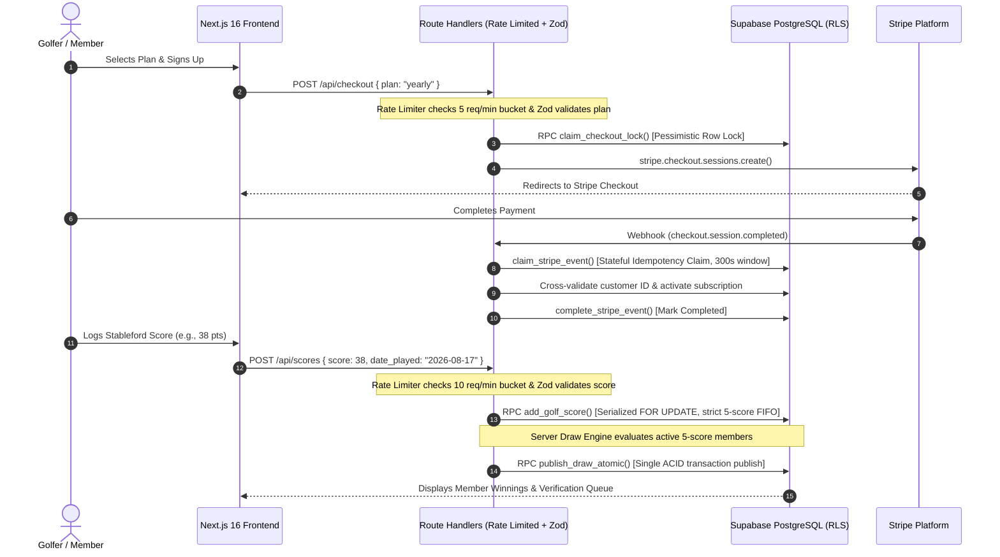
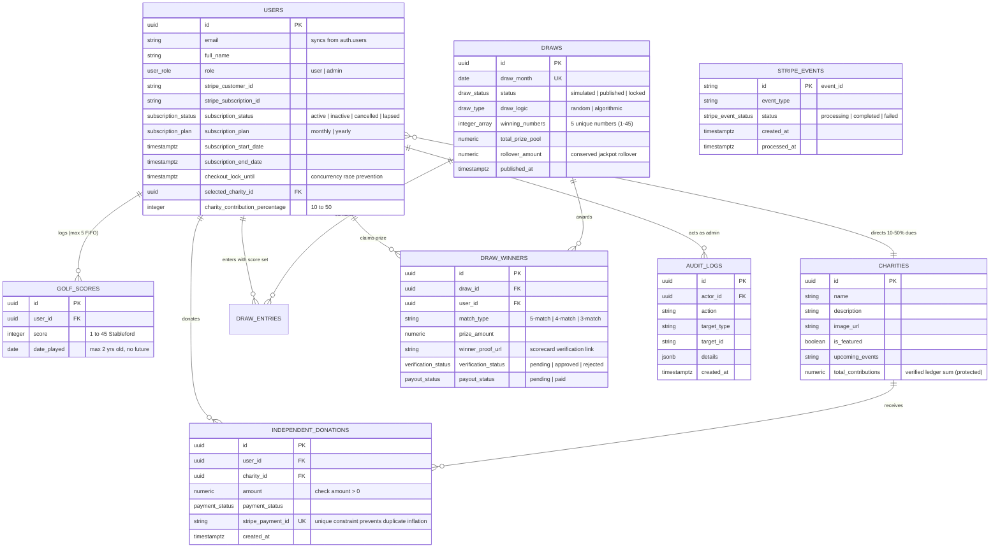

# ⛳ GolfForGood — Golf Charity Subscription & Prize Draw Platform

[](https://nextjs.org/)
[](https://react.dev/)
[](https://www.typescriptlang.org/)
[](https://zod.dev/)
[](https://supabase.com/)
[](https://stripe.com/)
[](https://vitest.dev/)

> **A full-stack SaaS platform combining golf score tracking, verified charitable contributions, and simulated skill-based monthly prize draws.** Built with Next.js 16 (App Router), React 19, TypeScript, Zod Schema Validation, Supabase (PostgreSQL with RLS, triggers, and atomic RPCs), and Stripe Billing.

---

## 📌 Project Scope & Educational Disclaimer

> [!NOTE]
> **Educational & Portfolio Demonstration**  
> **GolfForGood** is an educational software engineering project created to demonstrate full-stack architecture, relational database integrity, idempotent financial processing, application-level rate limiting, and stateful webhook synchronization.
> 
> The monthly prize draws and payout workflows are **simulated demonstrations** designed to showcase mathematical pool conservation, scorecard verification queues, and recoverable payout failure paths. This application is **not** an operational real-money gambling, lottery, or commercial wagering service.

---

## 📖 Overview & Core Mechanisms

**GolfForGood** connects golfers' athletic performance with verified philanthropic giving. Members maintain a recurring monthly (₹499/mo) or annual (₹4,999/yr) subscription, record their 18-hole Stableford golf scores (1–45 points), direct a customizable portion of their membership dues (10%–50%) to partner charities, and enter simulated monthly skill-based prize draws.

### Technical Pillars
- 🏆 **Athletic Score Tracking**: Members submit authentic golf rounds (1–45 Stableford points) with a strict 5-round FIFO history and proof scorecard uploads.
- 💚 **Philanthropic Allocation**: 10%–50% of membership dues and direct donations route to partner causes with real-time transparent ledgers.
- 🎰 **Simulated Prize Draws**: Monthly draws allocate 40% (Jackpot), 35%, and 25% across 5-match, 4-match, and 3-match score tiers, conserving all residual funds into rolling jackpots.
- 🛡️ **Technical Robustness**: Powered by Zod schema validation, sliding-window rate limiting, Supabase Row-Level Security (RLS), server-side role authorization, Stripe webhook signature verification, stateful idempotency with in-flight lock isolation, transactional PostgreSQL stored procedures (`SECURITY DEFINER`), and immutable administrative audit logs.

---

## 🏗️ System Architecture

```
   Next.js 16 (App Router / React 19 Frontend)
                      │
                      ▼
   Rate Limiter Layer (Sliding-Window IP / Request Throttling)
                      │
                      ▼
   Route Handlers & Server API Layer
   (Server-Side Auth, Zod Schema Validation, Error Guards)
                      │
                      ▼
   Supabase PostgreSQL Database
   (Row-Level Security, Database Triggers, Transactional RPCs)
                      │
                      ▼
   Stripe Billing & Payments Platform
   (Checkout Sessions, Customer Portal, Webhook Deliveries)
                      │
                      ▼
   Stripe Webhook Route Handler (/api/webhooks/stripe)
   (Cryptographic Signature Verification)
                      │
                      ▼
   Idempotent Business Processing & Audit Logging
   (Stateful stripe_events Claims, Conserved Accounting, Audit Trail)
```

### Architectural Sequence Flow



---

## 🗄️ Database Schema & Entity-Relationship (ER) Model



---

## ⚙️ Core Technical Mechanisms

### 1. Zod Schema Validation Layer
- All API inputs are parsed and validated through strongly-typed Zod schemas (`ScoreSchema`, `CheckoutSchema`, `DonationSchema`, `CharitySchema`, `WinnerStatusUpdateSchema`, `DrawActionSchema`, `ProofUrlSchema`).
- Inferred TypeScript types (`ScoreInput`, `DonationInput`, etc.) ensure complete type safety from Route Handlers through Database RPC invocations.

### 2. Application-Level Sliding-Window Rate Limiting
- In-memory sliding-window rate limiter (`src/lib/rate-limit.ts`) throttles sensitive endpoints using client IP extraction (`x-forwarded-for`, `x-real-ip`).
- Standard RFC headers returned: `X-RateLimit-Limit`, `X-RateLimit-Remaining`, `X-RateLimit-Reset`, and `Retry-After` on HTTP 429 Too Many Requests.
- Throttling rules:
  - `POST /api/scores`: Max 10 requests / min
  - `POST /api/checkout`: Max 5 requests / min
  - `POST /api/donations`: Max 5 requests / min
  - `POST /api/billing`: Max 5 requests / min

### 3. Supabase Row-Level Security (RLS) & Server-Side Authorization
- Direct client `INSERT` on `public.golf_scores` is disabled. Score additions must execute through the `add_golf_score(p_user_id, p_score, p_date_played)` stored procedure running as `SECURITY DEFINER`.
- All admin endpoints enforce server-side validation via `assertAdminAPI()`, verifying session claims and database `users.role = 'admin'` before allowing administrative actions.

### 4. Transactional 5-Score FIFO Limit & Row Locking
- The `add_golf_score` PostgreSQL function acquires a row-level lock (`PERFORM id FROM public.users WHERE id = p_user_id FOR UPDATE`) to serialize concurrent submissions.
- When a 6th round is submitted, the oldest score is pruned transactionally, guaranteeing each member retains exactly 5 current scores.

### 5. Stateful Stripe Webhook Idempotency & 300s In-Flight Isolation
- Webhook events transition through explicit states: `processing` $\longrightarrow$ `completed` (or `failed`).
- In-flight execution is isolated with a **300-second (5-minute)** window in `claim_stripe_event()` to prevent concurrent duplicate processing during upstream latency.
- Fail-closed error handling: If the business operation or event finalization fails, HTTP 500 is returned, prompting Stripe to retry according to standard backoff schedules.

### 6. Idempotent Donation Ledger & Unique Stripe Payment Constraint
- The `public.independent_donations` table enforces a unique constraint on `stripe_payment_id`.
- The `record_completed_donation()` RPC is idempotent: duplicate webhook events return the existing donation record without double-incrementing `charities.total_contributions`.
- The `protect_charity_contributions()` database trigger blocks direct manual mutations of `charities.total_contributions`.

### 7. Winner Proof Verification & Payout Protection
- A `BEFORE UPDATE` trigger on `public.draw_winners` restricts regular members to updating only `winner_proof_url` while `verification_status = 'pending'`.
- All other columns (`prize_amount`, `verification_status`, `payout_status`, etc.) are protected against user tampering.
- A database `CHECK` constraint (`chk_draw_winners_payout_verified`) ensures `payout_status = 'paid'` cannot be set unless `verification_status = 'approved'`.

### 8. Conserved Integer Currency Arithmetic (Zero Float Drift)
- Financial calculations convert amounts to integer subunits (paise/cents via `toCents`) and convert back via `fromCents`.
- Conservation invariant: $\text{Total Distributed} + \text{Rollover} \equiv \text{Total Prize Pool}$ with zero floating-point rounding errors.

---

## 🔄 End-to-End Critical Path & Failure Recovery

The system's financial and state transitions are verified across 5 critical stages:

```
[1] Payment Succeeds     ──▶  Webhook Received & Verified (Status: Processing)
                                     │
[2] Duplicate Payment    ──▶  Active Lock Blocks Re-checkout / Ledger Uses Unique Stripe ID
                                     │
[3] Webhook Retries      ──▶  Idempotency Check Detects Completed Event (No Double Credit)
                                     │
[4] Draw Succeeds        ──▶  Prize Distribution Conserves Remainder Into Rollover Pool
                                     │
[5] Payout Fails / Abort ──▶  Fail-Closed State Leaves Record in 'Pending' (Admin Can Retry)
```

| Lifecycle Stage | Expected Behavior | Defensive Implementation |
| :--- | :--- | :--- |
| **1. Payment succeeds $\to$ Webhook received** | Subscription activated / donation logged. | Cryptographic signature validation, `claim_stripe_event()`, customer cross-check. |
| **2. Payment duplicated $\to$ No duplicate credit** | Member not double-charged; donation not duplicated. | `claim_checkout_lock()` blocks active members; `UNIQUE(stripe_payment_id)` prevents donation ledger inflation. |
| **3. Webhook retries $\to$ Idempotent** | Safe acknowledgment without re-running business logic. | `claim_stripe_event()` recognizes `completed` status and returns 200 OK without mutations. |
| **4. Draw succeeds $\to$ Prize accounting consistent** | Exact prize pool distribution without money loss. | Integer cents math; unawarded tier allocations and integer division remainders roll over to Month+1. |
| **5. Payout fails $\to$ State recoverable** | State is uncorrupted if a payout or network call fails. | Fail-closed error handling; `payout_status` remains `pending` and can be safely retried from the Admin Panel. |

---

## 💬 Interview Deep Dive & Technical Q&A

### Q1: Why is the Stripe webhook idempotent?
> **Answer**: Stripe webhooks operate on an "at-least-once" delivery model. Network timeouts, slow database responses, or dropped connections can cause Stripe to retry delivering the exact same event multiple times. Without idempotency, a retried `checkout.session.completed` event could double-credit charity balances or create duplicate records. We enforce idempotency with a stateful `stripe_events` ledger and unique payment constraints so duplicate deliveries are recognized and safely acknowledged without re-executing business logic.

### Q2: Why is authorization enforced server-side?
> **Answer**: Client-side authorization checks (such as hiding UI buttons) can be trivially bypassed by inspecting JavaScript bundles or issuing direct HTTP requests. Enforcing authorization server-side in API route handlers (`assertAdminAPI()`) and inside the database layer (Supabase RLS and `SECURITY DEFINER` stored procedures) ensures that caller identity and permissions are authoritatively validated on every single mutation.

### Q3: How does Row-Level Security (RLS) protect tenant/user data?
> **Answer**: RLS operates at the PostgreSQL database engine level rather than relying on application code filters. When a query is executed, PostgreSQL evaluates the RLS policy against the authenticated caller's JWT (`auth.uid()`). This prevents horizontal privilege escalation (User A viewing or editing User B's scorecard) and vertical privilege escalation (a standard user updating their own role to admin or manually setting `payout_status = 'paid'`).

---

## 🔌 API Route Reference

| Endpoint | Method | Access | Rate Limit | Purpose | Status Codes |
| :--- | :--- | :--- | :--- | :--- | :--- |
| `/api/checkout` | `POST` | Authenticated | 5 / min | Claims concurrency lock & creates Stripe Subscription Checkout | `200`, `400`, `401`, `409`, `429`, `500` |
| `/api/billing` | `POST` | Authenticated | 5 / min | Creates Stripe Customer Billing Portal Session | `200`, `400`, `401`, `429`, `500` |
| `/api/donations` | `POST` | Public / Auth | 5 / min | Creates Stripe Checkout Session for verified charity donation | `200`, `400`, `429`, `500` |
| `/api/scores` | `GET` | Authenticated | Standard | Retrieves current member's 5 recent scores | `200`, `401`, `500` |
| `/api/scores` | `POST` | Authenticated | 10 / min | Submits score via transactional 5-score FIFO RPC | `201`, `400`, `401`, `429`, `500` |
| `/api/webhooks/stripe` | `POST` | Stripe Signature | Webhook | Webhook handler with 300s idempotency & fail-closed execution | `200`, `400`, `500` |
| `/api/admin/charities` | `GET`, `POST`, `PATCH`, `DELETE` | Admin Role | Standard | Charity CRUD with donation history deletion protection | `200`, `400`, `401`, `403`, `409`, `500` |
| `/api/admin/draws` | `GET`, `POST` | Admin Role | Standard | Draw management: `simulate`, `publish`, `lock`, `forceRegenerate` | `200`, `400`, `401`, `403`, `500` |
| `/api/admin/winners` | `GET`, `PATCH` | Admin Role | Standard | Scorecard proof review, approval/rejection, payout status update | `200`, `400`, `401`, `403`, `500` |
| `/api/admin/users` | `GET` | Admin Role | Standard | Lists member accounts, subscription states, and assigned roles | `200`, `401`, `403`, `500` |

---

## 🧪 Automated Test Suites (97 Tests)

The codebase includes 97 automated unit and regression tests written with **Vitest**:

- [`src/__tests__/security-regression.test.ts`](file:///src/__tests__/security-regression.test.ts) (27 tests): Verifies RLS invariants, FIFO limits, authorization barriers, and trigger guards.
- [`src/__tests__/validations.test.ts`](file:///src/__tests__/validations.test.ts) (24 tests): Validates Zod schema parsing and input helpers for scores, donations, checkout plans, and draw actions.
- [`src/__tests__/auth-security.test.ts`](file:///src/__tests__/auth-security.test.ts) (13 tests): Tests administrative privilege barriers, caller identity matching, and fail-closed configurations.
- [`src/__tests__/draw.service.test.ts`](file:///src/__tests__/draw.service.test.ts) (12 tests): Tests winning number generation (CSPRNG & deterministic SHA-256), anti-inflation score matching, and integer prize pool distribution.
- [`src/__tests__/failure-path-recovery.test.ts`](file:///src/__tests__/failure-path-recovery.test.ts) (8 tests): Validates the 5-stage critical path (payment $\to$ duplicate prevention $\to$ webhook idempotency $\to$ prize accounting $\to$ payout failure recovery).
- [`src/__tests__/webhook-idempotency.test.ts`](file:///src/__tests__/webhook-idempotency.test.ts) (8 tests): Tests stateful webhook transitions, in-flight isolation (300s), and retry safety.
- [`src/__tests__/rate-limit.test.ts`](file:///src/__tests__/rate-limit.test.ts) (5 tests): Tests sliding-window bucket sliding, IP isolation, header formatting, and HTTP 429 throttling.

---

## 💻 Tech Stack

- **Framework**: Next.js 16.2.0 (App Router, Server Components, Route Handlers)
- **Runtime & Language**: Node.js 20.x, TypeScript 5
- **Schema Validation**: Zod 3.24.2
- **UI & Styling**: Vanilla CSS Design System with Curated Golf SaaS Palette
- **Database & Auth**: Supabase PostgreSQL with RLS, Triggers, and Stored Procedures (`SECURITY DEFINER`)
- **Payments & Billing**: Stripe Subscriptions, Checkout, Billing Portal, Webhooks
- **Testing**: Vitest 3.0.7
- **Transactional Email**: Resend API

---

## 🚀 Getting Started

### 1. Prerequisites
- Node.js 18.x or 20.x
- npm 9+
- A Supabase Project ([supabase.com](https://supabase.com))
- A Stripe Account ([stripe.com](https://stripe.com))

### 2. Environment Configuration
Create a `.env.local` file in the root directory (see `.env.example`):

```env
# Public Variables (Browser Accessible)
NEXT_PUBLIC_SUPABASE_URL=https://your-project-ref.supabase.co
NEXT_PUBLIC_SUPABASE_ANON_KEY=eyJhbGciOi...
NEXT_PUBLIC_STRIPE_PUBLISHABLE_KEY=pk_test_51...
NEXT_PUBLIC_APP_URL=http://localhost:3000

# Private Variables (Server-Only)
SUPABASE_SERVICE_ROLE_KEY=eyJhbGciOi...
STRIPE_SECRET_KEY=sk_test_51...
STRIPE_WEBHOOK_SECRET=whsec_...
STRIPE_MONTHLY_PRICE_ID=price_1...
STRIPE_YEARLY_PRICE_ID=price_1...
RESEND_API_KEY=re_...
EMAIL_FROM=Golf Platform <notifications@golfforgood.org>
NODE_ENV=development
```

### 3. Database Setup
Copy the contents of [`supabase/schema.sql`](file:///supabase/schema.sql) and execute it in your **Supabase SQL Editor** to provision tables, triggers, indexes, and RLS policies.

### 4. Running Locally
```bash
npm install
npm run dev
```
Open [http://localhost:3000](http://localhost:3000) in your browser.

### 5. Running the Test Suite
```bash
npm test
```

---

## 🛠️ Step-by-Step Git Commands (4 Clean Commits)

### Commit 1: Zod Schema Integration
```bash
git add src/lib/validations/index.ts src/__tests__/validations.test.ts
git commit -m "feat(validations): wire Zod schemas with safeParse and inferred types"
```

### Commit 2: Sliding-Window Rate Limiter
```bash
git add src/lib/rate-limit.ts src/app/api/scores/route.ts src/app/api/checkout/route.ts src/app/api/donations/route.ts src/app/api/billing/route.ts src/__tests__/rate-limit.test.ts
git commit -m "feat(security): implement sliding-window rate limiting on mutation endpoints"
```

### Commit 3: Scaffolding Cleanup
```bash
git rm AGENTS.md
git commit -m "chore(cleanup): remove AGENTS.md scaffolding artifact"
```

### Commit 4: Documentation & Test Badge Synchronization
```bash
git add README.md
git commit -m "docs(architecture): update test count badge to 97 tests, document Zod and rate limiting"
```

---

## 📄 License & Disclaimer

This project is open source and built for educational and portfolio demonstration purposes as a simulated golf charity subscription platform. It is not intended for operational commercial gambling or real-money lottery operations.
